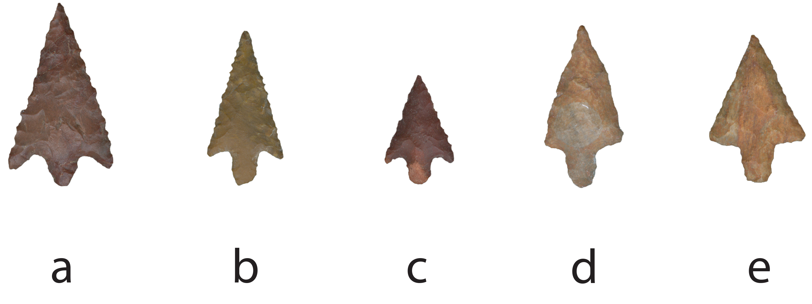

# perdiz

Temporal assignments carry substantive weight, and archaeologists regularly assume that artefacts from discrete temporal units may differ in ways that convey changes in preference or behaviour. Similarly, archaeologists regularly assume that raw material differences articulate with stone tool morphology, and the role of differential raw material quality and preference associated with Caddo lithic technology remains largely unexplored. Whether a particular artefact is found in or outside of burial contexts is a sensitive and regularly discussed topic in the archaeological literature, providing valuable insights related to prehistoric burial practices, as well as generational shifts in aesthetics, design, and raw material preferences. These assumptions were tested using geometric morphometrics, yielding results in support of the hypothesis that Perdiz arrow point shape is protean, and that significant differences existed in shape by time, raw material, and burial context.

This exploratory study assesses whether Perdiz arrow points differ in shape by 1) _time_ as a means of identifying whether abrupt or gradual shape changes occur in Perdiz arrow points through the Middle, Late, and Historic Caddo periods, 2) _raw material_ as a means of identifying whether Perdiz arrow point shape differs if produced using chert, quartzite, or silicified wood, and 3) _burial context_ as a potential means of exploring design intent.

[https://aksel-blaise.github.io/perdiz/](https://aksel-blaise.github.io/perdiz/)

## Primary findings

* Perdiz arrow point shape differs by time
* Perdiz arrow point shape differs by raw material
* Perdiz arrow point shape differs by burial context

## Acknowledgments

We express our gratitude to the Caddo Nation of Oklahoma and the Anthropology and Archaeology Laboratory at Stephen F. Austin State University for the requisite permissions and access to the NAGPRA items from the Washington Square Mound site and Turner collection. Thanks to Dan McGregor for information on Pisgah Ridge chert, and to Christian S. Hoggard, David K. Thulman, Michael J. O'Brien, Scott W. Hammerstedt, and Julian A. Sitters, as well as the editors and reviewers for their comments and constructive criticisms that further improved the manuscript.

## Funding

Components of this analytical work flow were developed and funded by a Preservation Technology and Training grant (P14AP00138) to RZS from the National Center for Preservation Technology and Training (NCPTT), as well as additional grants to RZS from the Caddo Nation of Oklahoma, National Forests and Grasslands in Texas (15-PA-11081300-033), and United States Forest Service (20-PA-11081300-074).

## Data management

The analysis code associated with this project can be accessed through this document or the [GitHub](https://github.com/aksel-blaise/perdiz) repository, which is digitally curated on the Open Science Framework [DOI: 10.17605/OSF.IO/DEJ74](https://osf.io/dej74/).
