Perdiz arrow point shape as a function of site, raw material, and/or
mortuary context?
================
Robert Z. Selden, Jr.
25 September, 2020

# Elliptical Fourier Analysis

## Load packages + data

``` r
# load packages
library(here)
```

    ## here() starts at D:/github/perdiz

``` r
library(Momocs)
```

    ## 
    ##   Momocs is now retired and will no longer be maintained.
    ##   It is superseded by Momocs2 and more generally MomX ecosystem:
    ## 
    ##              <   https://momx.github.io   >

    ## 
    ## Attaching package: 'Momocs'

    ## The following object is masked from 'package:stats':
    ## 
    ##     filter

``` r
# read images
jpg.list <- list.files(here("/img.perdiz"), full.names = TRUE)

# read attribute data
att.data <- read.csv("perdiz.csv", header = TRUE, as.is = TRUE)

# attribute to factor
att.data$context <- as.factor(att.data$context)
att.data$trinomial <- as.factor(att.data$trinomial)
att.data$raw.mat <- as.factor(att.data$raw.mat)
```

## Generate outlines

``` r
# generate outlines
outlines <- jpg.list %>%
  import_jpg()
```

    ## Extracting 108.jpg outlines...

    ## [ 1 / 108 ]  489.jpg
    ## [ 2 / 108 ]  490.jpg
    ## [ 3 / 108 ]  553.jpg
    ## [ 4 / 108 ]  554.jpg
    ## [ 5 / 108 ]  555.jpg
    ## [ 6 / 108 ]  556.jpg
    ## [ 7 / 108 ]  558.jpg
    ## [ 8 / 108 ]  559.jpg
    ## [ 9 / 108 ]  562.jpg
    ## [ 10 / 108 ]  565.jpg
    ## [ 11 / 108 ]  591.jpg
    ## [ 12 / 108 ]  598.jpg
    ## [ 13 / 108 ]  645.jpg
    ## [ 14 / 108 ]  646.jpg
    ## [ 15 / 108 ]  647.jpg
    ## [ 16 / 108 ]  648.jpg
    ## [ 17 / 108 ]  649.jpg
    ## [ 18 / 108 ]  650.jpg
    ## [ 19 / 108 ]  651.jpg
    ## [ 20 / 108 ]  652.jpg
    ## [ 21 / 108 ]  653.jpg
    ## [ 22 / 108 ]  654.jpg
    ## [ 23 / 108 ]  655.jpg
    ## [ 24 / 108 ]  656.jpg
    ## [ 25 / 108 ]  657.jpg
    ## [ 26 / 108 ]  658.jpg
    ## [ 27 / 108 ]  659.jpg
    ## [ 28 / 108 ]  660.jpg
    ## [ 29 / 108 ]  661.jpg
    ## [ 30 / 108 ]  665.jpg
    ## [ 31 / 108 ]  677.jpg
    ## [ 32 / 108 ]  678.jpg
    ## [ 33 / 108 ]  hs15-fig7.1r.jpg
    ## [ 34 / 108 ]  hs15-fig7.1t.jpg
    ## [ 35 / 108 ]  hs15-fig7.1u.jpg
    ## [ 36 / 108 ]  hs15-fig7.1v.jpg
    ## [ 37 / 108 ]  hs15-fig7.1w.jpg
    ## [ 38 / 108 ]  hs15-fig7.1x.jpg
    ## [ 39 / 108 ]  hs15-fig7.2b.jpg
    ## [ 40 / 108 ]  hs15-fig7.2c.jpg
    ## [ 41 / 108 ]  hs15-fig7.2d.jpg
    ## [ 42 / 108 ]  hs15-fig7.2e.jpg
    ## [ 43 / 108 ]  hs15-fig7.2f.jpg
    ## [ 44 / 108 ]  hs15-fig7.2g.jpg
    ## [ 45 / 108 ]  hs15-fig7.2m.jpg
    ## [ 46 / 108 ]  hs15-fig7.2o.jpg
    ## [ 47 / 108 ]  hs15-fig7.2q.jpg
    ## [ 48 / 108 ]  hs15-fig7.2r.jpg
    ## [ 49 / 108 ]  hs15-fig7.3a.jpg
    ## [ 50 / 108 ]  hs15-fig7.3aa.jpg
    ## [ 51 / 108 ]  hs15-fig7.3b.jpg
    ## [ 52 / 108 ]  hs15-fig7.3bb.jpg
    ## [ 53 / 108 ]  hs15-fig7.3cc.jpg
    ## [ 54 / 108 ]  hs15-fig7.3d.jpg
    ## [ 55 / 108 ]  hs15-fig7.3e.jpg
    ## [ 56 / 108 ]  hs15-fig7.3f.jpg
    ## [ 57 / 108 ]  hs15-fig7.3g.jpg
    ## [ 58 / 108 ]  hs15-fig7.3h.jpg
    ## [ 59 / 108 ]  hs15-fig7.3i.jpg
    ## [ 60 / 108 ]  hs15-fig7.3j.jpg
    ## [ 61 / 108 ]  hs15-fig7.3k.jpg
    ## [ 62 / 108 ]  hs15-fig7.3l.jpg
    ## [ 63 / 108 ]  hs15-fig7.3m.jpg
    ## [ 64 / 108 ]  hs15-fig7.3n.jpg
    ## [ 65 / 108 ]  hs15-fig7.3o.jpg
    ## [ 66 / 108 ]  hs15-fig7.3p.jpg
    ## [ 67 / 108 ]  hs15-fig7.3q.jpg
    ## [ 68 / 108 ]  hs15-fig7.3r.jpg
    ## [ 69 / 108 ]  hs15-fig7.3s.jpg
    ## [ 70 / 108 ]  hs15-fig7.3t.jpg
    ## [ 71 / 108 ]  hs15-fig7.3u.jpg
    ## [ 72 / 108 ]  hs15-fig7.3v.jpg
    ## [ 73 / 108 ]  hs15-fig7.3w.jpg
    ## [ 74 / 108 ]  hs15-fig7.3x.jpg
    ## [ 75 / 108 ]  hs15-fig7.3y.jpg
    ## [ 76 / 108 ]  hs15-fig7.3z.jpg
    ## [ 77 / 108 ]  na49-1.jpg
    ## [ 78 / 108 ]  na49-10.jpg
    ## [ 79 / 108 ]  na49-11.jpg
    ## [ 80 / 108 ]  na49-12.jpg
    ## [ 81 / 108 ]  na49-13.jpg
    ## [ 82 / 108 ]  na49-137.jpg
    ## [ 83 / 108 ]  na49-14.jpg
    ## [ 84 / 108 ]  na49-149.jpg
    ## [ 85 / 108 ]  na49-176.jpg
    ## [ 86 / 108 ]  na49-187.jpg
    ## [ 87 / 108 ]  na49-195.jpg
    ## [ 88 / 108 ]  na49-2.jpg
    ## [ 89 / 108 ]  na49-271.jpg
    ## [ 90 / 108 ]  na49-3.jpg
    ## [ 91 / 108 ]  na49-33.jpg
    ## [ 92 / 108 ]  na49-4.jpg
    ## [ 93 / 108 ]  na49-5.jpg
    ## [ 94 / 108 ]  na49-587.jpg
    ## [ 95 / 108 ]  na49-616.jpg
    ## [ 96 / 108 ]  na49-7.jpg
    ## [ 97 / 108 ]  na49-734.jpg
    ## [ 98 / 108 ]  na49-8.jpg
    ## [ 99 / 108 ]  na49-9.jpg
    ## [ 100 / 108 ]  sy280-1.jpg
    ## [ 101 / 108 ]  sy280-2.jpg
    ## [ 102 / 108 ]  sy280-3.jpg
    ## [ 103 / 108 ]  sy43-1.jpg
    ## [ 104 / 108 ]  sy43-2.jpg
    ## [ 105 / 108 ]  sy43-3.jpg
    ## [ 106 / 108 ]  sy43-4.jpg
    ## [ 107 / 108 ]  sy43-5.jpg
    ## [ 108 / 108 ]  sy43-6.jpg

    ## Done in 12.3 secs

``` r
# add attributes
data.out <- Out(outlines, 
         fac = att.data)

# scale, align, rotate, and center specimens
norm.outlines <- data.out %>% 
  coo_scale() %>%
  coo_align() %>% 
  coo_center()
```

## Pile and mosaics

``` r
# outline pile
pile(norm.outlines)
```

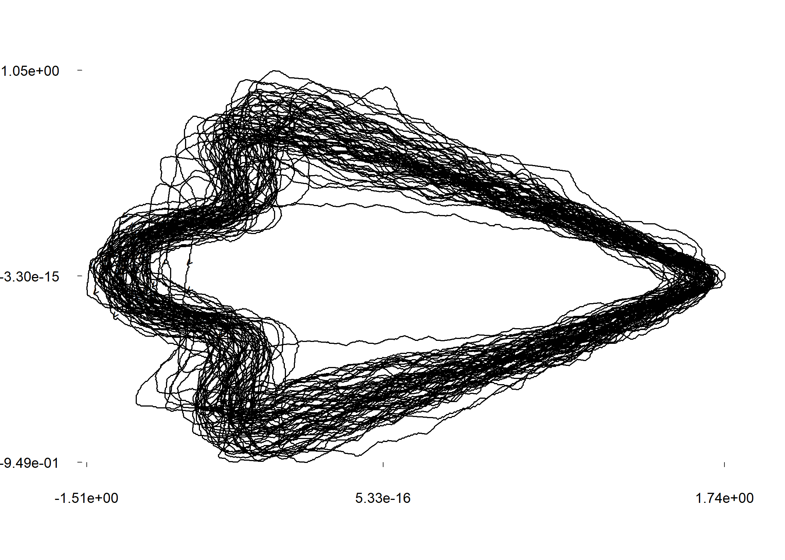

``` r
# mosaic of individual specimens from the different sites
mosaic(norm.outlines, ~trinomial)
```

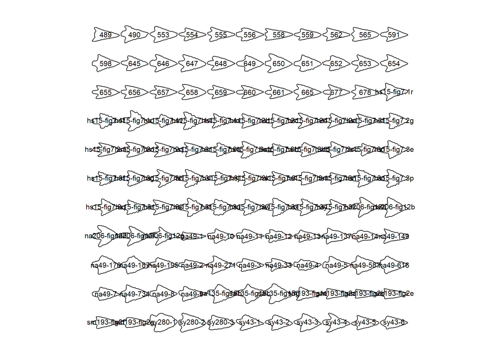

``` r
# mosaic of individual specimens rendered from different materials
mosaic(norm.outlines, ~raw.mat)
```

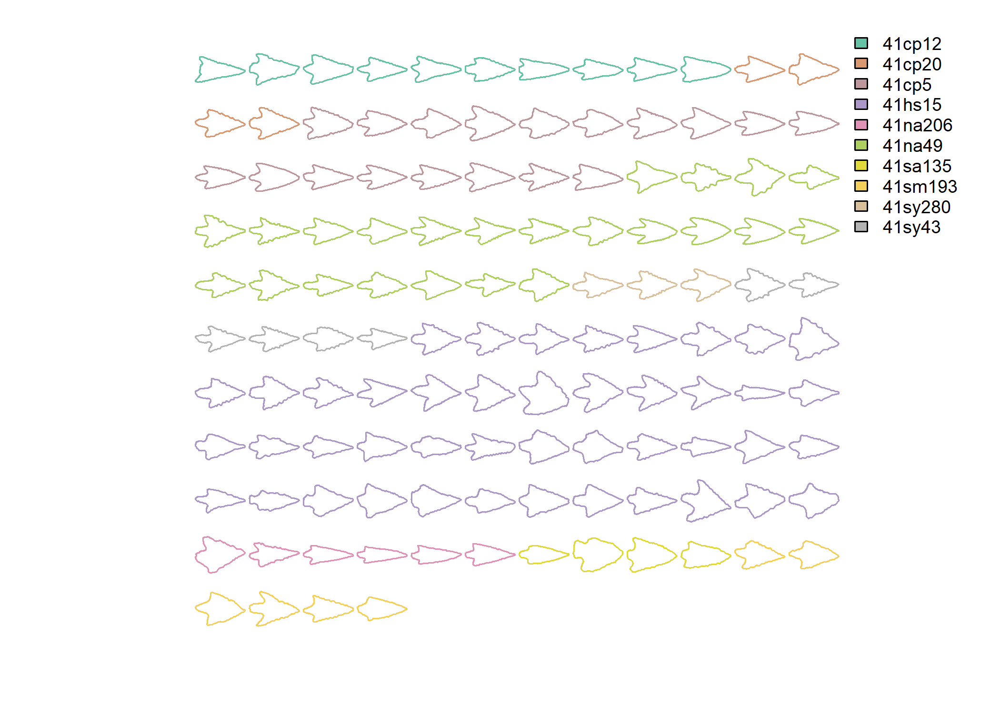

``` r
# mosaic of individual specimens from contexts (mortuary/not)
mosaic(norm.outlines, ~context)
```

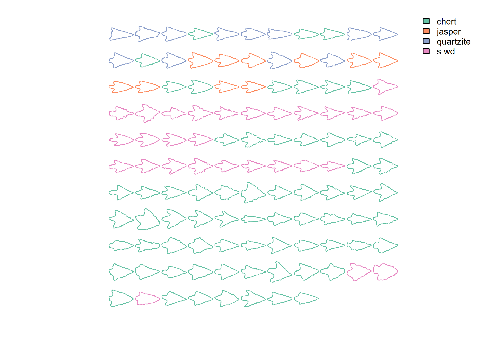

## Calibrate harmonic + EFA

``` r
# calibrate how many harmonics needed
calibrate_harmonicpower_efourier(norm.outlines, 
                                 nb.h = 30)
```

    ## $gg

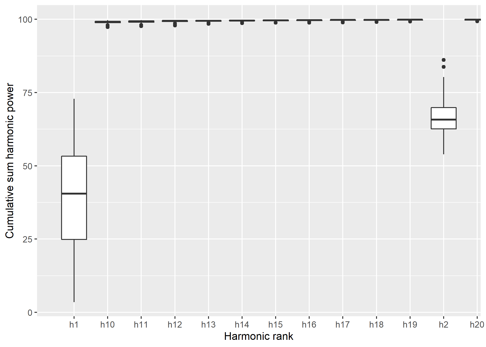

    ## 
    ## $q
    ##                      h1       h2       h3       h4       h5       h6       h7
    ## 489           72.808791 83.78198 95.17554 95.58620 96.94914 97.61501 97.95870
    ## 490           64.114719 71.74229 80.72420 89.12673 91.89527 97.25527 97.89054
    ## 553           60.227643 67.66112 78.47978 88.42469 91.97133 97.96056 98.60926
    ## 554           40.784025 62.70509 71.02441 88.80778 92.02025 97.18926 98.19496
    ## 555           71.883368 75.67063 83.98654 89.34967 91.27061 96.88514 98.02617
    ## 556           40.131674 62.71068 66.15981 84.78732 88.45546 94.74772 96.20115
    ## 558           63.012149 77.73567 90.06870 90.36598 91.90045 93.94937 94.75257
    ## 559           37.440231 60.66242 71.29934 86.72881 90.17083 96.07668 97.22067
    ## 562           60.694645 69.96634 77.12798 87.14123 90.12571 96.20471 97.29606
    ## 565           64.493270 80.33025 89.87705 90.69617 92.26710 94.75796 95.81031
    ## 591           32.410597 64.36665 71.82945 90.72323 94.12426 97.00883 98.55887
    ## 598           54.095190 69.79342 80.21895 91.62848 93.17747 97.30424 98.48432
    ## 645           37.430706 61.77266 70.12401 88.30539 92.41149 97.17813 98.23178
    ## 646           48.472059 67.04623 73.39793 90.58139 94.34818 96.89540 98.59301
    ## 647           63.962317 66.40189 73.20076 87.28925 92.34106 97.84810 98.43246
    ## 648           51.661887 60.75373 67.73491 84.11689 90.80362 96.67577 97.48979
    ## 649           13.198214 67.02359 73.20792 91.32686 96.27920 97.08839 97.94181
    ## 650           62.500557 67.69024 73.36673 89.73518 94.63252 98.08290 98.54933
    ## 651           25.861992 55.85938 68.03343 87.64255 92.73702 96.70377 98.18765
    ## 652           22.576477 60.60679 68.19757 89.37573 93.98487 96.56320 97.92897
    ## 653           53.506327 62.33004 70.77582 88.94387 93.68013 97.88528 98.55523
    ## 654           44.031205 66.31590 73.29146 91.93527 95.20683 97.46861 98.89531
    ## 655           53.169643 60.43443 64.83868 83.34328 89.55824 96.76372 97.87205
    ## 656           57.110466 63.11221 68.16400 82.60450 87.07412 95.61119 97.38995
    ## 657           44.153580 55.01196 61.02296 82.80466 87.94802 95.93126 97.01850
    ## 658           61.749011 65.60642 71.58815 87.75926 93.23432 98.24621 98.52779
    ## 659           50.938090 63.91895 68.76493 86.94809 89.69221 95.89946 97.42615
    ## 660           44.673501 62.32531 67.80680 90.92520 94.83023 96.73639 98.51319
    ## 661           48.318800 59.00113 64.26505 85.67911 90.52577 96.55592 97.60929
    ## 665           72.904144 75.33543 80.78979 88.20015 91.08371 97.41274 98.34543
    ## 677           43.622937 58.91874 66.48334 89.42983 93.54165 96.83488 98.47343
    ## 678           70.247711 71.42578 81.10140 86.84716 90.52952 96.31749 98.02421
    ## hs15-fig7.1r  55.819696 71.01458 82.22449 93.28097 95.42506 98.12675 98.89801
    ## hs15-fig7.1t  11.961633 61.26533 63.25710 82.65330 89.87322 94.63257 96.26673
    ## hs15-fig7.1u  14.233972 65.75858 73.92966 93.02812 96.28352 96.85111 97.71074
    ## hs15-fig7.1v   3.492256 71.63388 75.33408 92.33748 95.19502 95.68231 96.75167
    ## hs15-fig7.1w  46.639077 66.92716 71.95296 89.48486 93.55210 97.14504 98.04232
    ## hs15-fig7.1x  46.019946 60.04771 68.99336 87.24467 91.43684 96.39134 97.81490
    ## hs15-fig7.2b  41.537124 61.83979 68.50133 88.05123 92.86222 96.73671 98.28909
    ## hs15-fig7.2c  26.210872 64.89798 72.92422 90.99264 94.35831 97.87073 98.61769
    ## hs15-fig7.2d  50.843985 63.21557 68.66386 91.27511 95.19385 97.36590 98.59038
    ## hs15-fig7.2e  37.102719 63.37788 72.40676 91.49551 95.20512 97.45446 98.60692
    ## hs15-fig7.2f  38.091666 53.88734 63.44261 85.55478 90.89651 95.83630 97.48680
    ## hs15-fig7.2g  13.353906 65.17654 72.59573 91.88886 95.38385 96.25522 97.37601
    ## hs15-fig7.2m  39.662894 62.79807 77.38253 95.18865 96.28126 97.14239 98.43765
    ## hs15-fig7.2o  45.828395 62.07647 71.40430 93.93353 96.45347 97.04749 98.79324
    ## hs15-fig7.2q  49.272394 63.76300 72.50353 93.88312 96.66015 97.40158 99.15950
    ## hs15-fig7.2r  37.645248 62.34001 71.06586 91.77327 95.62264 96.77956 98.40507
    ## hs15-fig7.3a   6.591274 67.86797 72.20289 90.78355 95.22879 95.48230 96.34243
    ## hs15-fig7.3aa 47.625663 66.53040 70.73643 89.11044 92.71088 97.12734 98.05346
    ## hs15-fig7.3b  18.570415 67.25161 71.32412 88.64994 92.17994 96.17440 97.62231
    ## hs15-fig7.3bb 19.270594 62.83549 71.09261 89.73132 95.00728 96.30606 97.60311
    ## hs15-fig7.3cc 22.874585 66.59133 76.59202 93.68998 96.32073 97.60104 98.51902
    ## hs15-fig7.3d  11.076212 72.04341 77.91163 91.50163 94.41508 95.25557 96.66404
    ## hs15-fig7.3e  16.397683 65.37038 69.87954 88.50356 94.60142 96.25158 98.07076
    ## hs15-fig7.3f  30.276454 65.29473 71.80241 90.06702 94.05178 96.39283 97.91267
    ## hs15-fig7.3g  23.894780 58.61507 66.14329 89.40797 93.28609 96.37736 97.87934
    ## hs15-fig7.3h  21.057798 68.75930 79.15366 93.54747 96.43109 97.11473 97.65978
    ## hs15-fig7.3i  27.462788 56.10201 64.21575 90.24945 93.90238 95.50411 97.57608
    ## hs15-fig7.3j  21.348830 64.47995 70.07761 89.15985 92.55359 95.70938 97.00793
    ## hs15-fig7.3k  27.552468 65.83402 72.31348 90.75328 95.42253 96.58027 97.93925
    ## hs15-fig7.3l  21.440250 60.51949 66.30950 89.43242 93.47248 95.90957 97.29707
    ## hs15-fig7.3m  13.119703 58.91781 65.09925 87.61667 90.91060 94.88178 96.09107
    ## hs15-fig7.3n  23.565703 66.86787 73.12740 90.74725 93.95903 96.23464 97.74376
    ## hs15-fig7.3o  34.173472 64.11802 68.42885 89.48982 93.02418 96.21821 98.41218
    ## hs15-fig7.3p  28.416763 56.92704 64.83637 90.29089 93.94560 95.60584 97.65143
    ## hs15-fig7.3q   8.730310 69.08153 74.80313 91.73953 97.13911 97.32774 98.05092
    ## hs15-fig7.3r  32.505703 58.59358 68.18273 88.52792 91.18938 95.97676 96.82514
    ## hs15-fig7.3s  62.792307 68.90132 72.39010 89.24210 93.46037 97.75214 98.49070
    ## hs15-fig7.3t  11.695277 65.59783 72.69486 90.70011 95.82473 96.19047 97.17574
    ## hs15-fig7.3u  23.135711 63.82916 68.28633 87.18427 89.33959 95.10053 95.99514
    ## hs15-fig7.3v  51.592916 68.04777 74.64281 89.80487 92.24139 95.13818 96.96480
    ## hs15-fig7.3w  16.056141 62.40911 70.59414 88.68918 93.77281 95.71197 97.15963
    ## hs15-fig7.3x  18.605514 64.04033 68.79147 89.19816 94.88594 96.35301 98.24728
    ## hs15-fig7.3y  29.720414 64.92382 72.05845 91.05246 94.53925 95.93626 98.29485
    ## hs15-fig7.3z  45.310242 63.62994 74.23827 92.14724 95.93388 97.37202 98.42731
    ## na49-1        31.921654 75.75622 77.75438 85.53597 87.68155 93.51100 93.95206
    ## na49-10       32.008246 69.77940 74.86502 86.55727 93.28558 96.86398 98.10591
    ## na49-11       42.199996 71.86912 76.35051 88.47760 90.84893 96.66611 97.98498
    ## na49-12       55.712313 71.83206 74.09161 84.99478 87.04896 93.82331 96.07732
    ## na49-13       48.817416 71.35210 75.64633 89.22010 90.63990 95.87327 97.22114
    ## na49-137      59.917382 70.02518 74.67464 88.09115 90.84073 95.48831 97.75657
    ## na49-14       25.829611 71.65096 74.27415 86.48891 86.92849 94.68605 96.81066
    ## na49-149      57.094759 64.48528 75.22863 85.24194 89.73042 96.76806 98.09828
    ## na49-176      24.056054 63.35709 71.43840 89.80090 93.76215 97.82298 98.51797
    ## na49-187      29.939669 74.40750 78.74296 90.81739 92.78665 96.75147 97.58693
    ## na49-195      39.681085 65.09278 74.90655 89.29705 92.30959 96.81509 97.92952
    ## na49-2        30.280713 68.17230 71.37316 86.65663 87.94489 95.16158 97.45114
    ## na49-271      60.294301 72.70936 78.78156 92.89525 94.86089 98.40826 98.98023
    ## na49-3        39.874872 66.73728 72.10141 86.91818 89.14735 95.90781 97.18568
    ## na49-33       41.317074 66.37250 74.33116 89.67273 92.61071 96.95974 98.11673
    ## na49-4        26.119974 71.01298 72.26403 83.56238 84.22867 89.26116 92.17965
    ## na49-5        37.554462 69.18960 75.29509 87.14672 91.91719 96.89021 98.17006
    ## na49-587      62.533170 74.12428 80.74202 91.72949 92.28497 97.36947 98.28266
    ## na49-616      69.723544 86.09821 91.30956 94.60831 95.15136 97.37226 98.34031
    ## na49-7        21.024722 65.80826 69.37707 86.89560 90.97629 96.72722 98.03434
    ## na49-734      57.186088 70.10897 78.07352 89.77037 91.38756 97.65835 98.65071
    ## na49-8        24.184139 67.02006 73.62160 89.73804 95.69156 98.01444 99.05675
    ## na49-9        61.274240 74.52665 80.51925 89.85001 91.42936 96.20940 97.55310
    ## sy280-1       49.454455 62.32477 73.86652 85.70561 92.10806 96.23968 97.52581
    ## sy280-2       71.228501 74.12065 81.29642 89.50642 91.61586 97.37249 98.30322
    ## sy280-3       57.692736 76.21813 81.49655 86.81075 89.23454 93.64286 95.48935
    ## sy43-1        46.220849 65.94746 78.00457 89.43500 92.72360 97.38535 98.02824
    ## sy43-2        24.336004 63.22271 74.18428 91.25984 94.29042 97.10462 98.11819
    ## sy43-3        25.004504 58.60052 70.02732 89.41425 95.07051 97.21588 98.18561
    ## sy43-4        47.103151 65.86668 75.70676 94.25650 96.85250 97.47922 99.16972
    ## sy43-5        47.012561 62.08855 71.39968 88.29861 91.17021 96.96058 97.85325
    ## sy43-6        41.250247 76.41672 79.61610 91.96321 92.75108 96.15273 97.42490
    ##                     h8       h9      h10      h11      h12      h13      h14
    ## 489           98.99222 99.27944 99.61408 99.66292 99.67257 99.74548 99.77200
    ## 490           98.43317 98.90168 99.21067 99.26009 99.39885 99.47944 99.54422
    ## 553           99.03073 99.36751 99.44516 99.53735 99.61913 99.67585 99.71820
    ## 554           98.35599 98.99227 99.07903 99.18155 99.65220 99.70881 99.74345
    ## 555           99.22945 99.34429 99.35722 99.65024 99.70336 99.74050 99.84641
    ## 556           97.07108 98.32436 98.35603 98.48074 98.91994 99.09404 99.22256
    ## 558           97.47642 98.23127 99.15827 99.24117 99.41253 99.50428 99.56908
    ## 559           97.71586 98.44616 98.50390 98.65258 99.15941 99.41700 99.61239
    ## 562           98.57226 99.03098 99.22437 99.49559 99.52488 99.55208 99.75261
    ## 565           98.49869 99.02328 99.61277 99.62274 99.65681 99.75540 99.77200
    ## 591           98.61906 98.76021 99.38794 99.56447 99.69590 99.74709 99.77566
    ## 598           98.73772 99.23659 99.27576 99.30295 99.50219 99.52999 99.55235
    ## 645           98.46989 98.73442 98.95378 99.08073 99.40631 99.44517 99.47290
    ## 646           98.84265 99.02189 99.39947 99.48570 99.57729 99.68552 99.70816
    ## 647           98.57160 99.16726 99.23451 99.33657 99.54623 99.61790 99.66645
    ## 648           97.90301 98.89001 98.98484 99.05226 99.30660 99.42561 99.52725
    ## 649           98.50792 98.74961 99.32895 99.45088 99.48496 99.54428 99.68207
    ## 650           98.77696 99.31998 99.46525 99.56771 99.71114 99.72319 99.74218
    ## 651           98.36471 98.70513 99.13669 99.30682 99.42507 99.45162 99.50142
    ## 652           98.12207 98.20926 99.08563 99.26329 99.35190 99.43444 99.46619
    ## 653           98.78018 99.26962 99.35380 99.44214 99.64394 99.65243 99.71399
    ## 654           98.97063 99.04404 99.48813 99.58569 99.67358 99.74212 99.75227
    ## 655           98.10188 99.14485 99.17562 99.18710 99.55622 99.62697 99.74582
    ## 656           98.24966 99.07245 99.19652 99.44583 99.52592 99.55966 99.75749
    ## 657           97.71437 98.65702 98.74675 98.81958 99.36470 99.57875 99.72769
    ## 658           98.82481 99.43320 99.46738 99.50607 99.77579 99.82474 99.84460
    ## 659           98.12618 99.17514 99.18318 99.26235 99.62159 99.66360 99.70855
    ## 660           98.64637 98.72393 99.36060 99.56113 99.71252 99.74223 99.74241
    ## 661           98.05560 98.94426 98.98235 99.00026 99.45111 99.52906 99.58658
    ## 665           99.00547 99.29183 99.36726 99.57786 99.63159 99.67359 99.78074
    ## 677           98.69266 98.80843 99.14402 99.27266 99.54711 99.57613 99.60539
    ## 678           99.25218 99.33627 99.38623 99.56052 99.60291 99.61013 99.70996
    ## hs15-fig7.1r  99.14445 99.46216 99.53570 99.57104 99.80852 99.81966 99.83328
    ## hs15-fig7.1t  96.30559 97.05405 97.37965 97.68537 97.91528 98.48375 98.83771
    ## hs15-fig7.1u  98.42582 98.80735 99.10013 99.15550 99.23822 99.37530 99.57870
    ## hs15-fig7.1v  98.03456 98.55526 98.98832 99.13677 99.21028 99.24223 99.41359
    ## hs15-fig7.1w  98.34440 98.68720 98.78427 98.81692 99.08484 99.21347 99.23501
    ## hs15-fig7.1x  97.97911 98.58752 98.68334 98.82865 99.18759 99.26229 99.27927
    ## hs15-fig7.2b  98.41903 98.87554 99.14840 99.28064 99.56862 99.59023 99.61297
    ## hs15-fig7.2c  98.63985 98.72932 99.34310 99.42656 99.59387 99.66389 99.69098
    ## hs15-fig7.2d  98.87393 99.01484 99.39497 99.46788 99.63781 99.67328 99.69695
    ## hs15-fig7.2e  98.73389 98.83679 99.27352 99.43728 99.54686 99.68011 99.69583
    ## hs15-fig7.2f  97.91446 98.47824 98.78906 99.03969 99.52387 99.58806 99.60423
    ## hs15-fig7.2g  98.08368 98.59876 99.21378 99.30124 99.34702 99.35211 99.46429
    ## hs15-fig7.2m  98.70772 99.14063 99.71863 99.74176 99.74601 99.75247 99.82270
    ## hs15-fig7.2o  98.88956 98.94942 99.60848 99.72730 99.76283 99.78948 99.81019
    ## hs15-fig7.2q  99.19503 99.20731 99.64938 99.69673 99.74472 99.75320 99.79997
    ## hs15-fig7.2r  98.54363 98.71137 99.50165 99.62861 99.66622 99.71779 99.75808
    ## hs15-fig7.3a  97.42627 97.86183 98.61686 98.84396 98.93340 99.00443 99.34028
    ## hs15-fig7.3aa 98.35572 98.71585 98.87761 98.91439 99.14191 99.17423 99.24514
    ## hs15-fig7.3b  97.71567 97.91414 98.76747 99.08403 99.27569 99.46999 99.50378
    ## hs15-fig7.3bb 97.66556 97.81934 98.86666 98.99213 99.13314 99.17921 99.24457
    ## hs15-fig7.3cc 98.72967 98.85835 99.54928 99.57935 99.63910 99.72677 99.76876
    ## hs15-fig7.3d  98.25830 98.80906 98.98655 99.19951 99.25817 99.32584 99.52457
    ## hs15-fig7.3e  98.26128 98.50777 98.92372 98.95239 98.96098 99.07449 99.17720
    ## hs15-fig7.3f  98.01910 98.21976 98.86027 99.09692 99.18943 99.27326 99.38965
    ## hs15-fig7.3g  98.01704 98.21598 98.79133 99.04367 99.45032 99.47886 99.48233
    ## hs15-fig7.3h  98.74711 99.20793 99.38552 99.50837 99.54767 99.61368 99.72748
    ## hs15-fig7.3i  97.74419 97.93742 98.58146 98.80833 98.97327 99.10012 99.17821
    ## hs15-fig7.3j  97.33589 97.66756 98.52733 98.92168 99.10671 99.15546 99.27407
    ## hs15-fig7.3k  98.36531 98.54378 99.27523 99.30703 99.32384 99.43549 99.54596
    ## hs15-fig7.3l  97.52374 97.66538 98.83516 99.04680 99.21354 99.29651 99.32499
    ## hs15-fig7.3m  96.37339 96.90719 97.69603 97.95576 98.44715 98.59974 98.74734
    ## hs15-fig7.3n  97.99901 98.35783 99.27923 99.33493 99.36485 99.51606 99.52551
    ## hs15-fig7.3o  98.51638 98.69575 99.15647 99.23734 99.33662 99.45000 99.47356
    ## hs15-fig7.3p  97.84038 97.99572 98.60210 98.84740 98.99802 99.12010 99.18527
    ## hs15-fig7.3q  98.98769 99.20794 99.34264 99.48152 99.49408 99.50599 99.56616
    ## hs15-fig7.3r  97.07296 97.60796 97.96517 98.09915 98.51632 98.61367 98.72322
    ## hs15-fig7.3s  98.79265 99.42449 99.46698 99.50864 99.75051 99.75819 99.77896
    ## hs15-fig7.3t  97.96898 98.58228 98.72475 99.21704 99.35428 99.40247 99.44529
    ## hs15-fig7.3u  96.50923 96.92812 97.61895 97.86204 98.65268 98.76538 99.13503
    ## hs15-fig7.3v  97.55565 97.90363 98.28821 98.55501 98.59690 99.31719 99.45217
    ## hs15-fig7.3w  97.54807 98.00790 98.71321 98.84790 98.95112 99.03850 99.06665
    ## hs15-fig7.3x  98.42385 98.59868 98.97510 99.02112 99.03469 99.15698 99.22072
    ## hs15-fig7.3y  98.38769 98.50542 99.16933 99.19989 99.20734 99.41429 99.46661
    ## hs15-fig7.3z  98.77284 98.84520 99.25591 99.55986 99.57798 99.76114 99.77613
    ## na49-1        96.45455 97.67232 98.82025 99.18009 99.24690 99.46825 99.50560
    ## na49-10       98.16499 98.66122 99.02378 99.19739 99.30166 99.57919 99.65491
    ## na49-11       98.33687 99.13666 99.17990 99.35672 99.48469 99.54577 99.66863
    ## na49-12       97.50756 98.11286 98.37351 99.07548 99.19511 99.27768 99.49350
    ## na49-13       98.46463 98.83135 98.85205 99.19195 99.22619 99.30331 99.45146
    ## na49-137      99.08951 99.21995 99.28047 99.38743 99.46698 99.52112 99.59822
    ## na49-14       97.19142 98.30435 98.38296 98.74302 98.91939 98.99713 99.18541
    ## na49-149      98.88719 99.14686 99.35429 99.45442 99.51308 99.59811 99.64661
    ## na49-176      98.66622 98.82294 99.06360 99.09015 99.13797 99.36106 99.52397
    ## na49-187      98.42608 98.77044 99.12634 99.23668 99.40085 99.44093 99.47351
    ## na49-195      98.22928 98.94052 99.02071 99.09363 99.47163 99.48354 99.51217
    ## na49-2        98.22426 98.71310 98.97968 99.01672 99.32761 99.38509 99.51621
    ## na49-271      99.15435 99.33773 99.45594 99.55950 99.77384 99.79261 99.80836
    ## na49-3        97.91435 98.68610 98.72109 99.03653 99.25363 99.42532 99.58646
    ## na49-33       98.17846 98.79069 98.89326 99.08333 99.49140 99.56867 99.61128
    ## na49-4        97.65624 98.27528 98.59534 98.85921 98.89302 99.01916 99.06482
    ## na49-5        98.55964 99.03843 99.12954 99.30570 99.35321 99.51407 99.56662
    ## na49-587      98.55538 99.29202 99.42066 99.56598 99.64220 99.71446 99.73503
    ## na49-616      98.54586 99.18812 99.41053 99.54191 99.58514 99.64289 99.70029
    ## na49-7        98.24096 98.80343 99.14321 99.19961 99.54526 99.56046 99.64805
    ## na49-734      98.99957 99.37450 99.44856 99.49435 99.56246 99.61164 99.65995
    ## na49-8        99.14584 99.18183 99.56418 99.57506 99.61390 99.65160 99.70296
    ## na49-9        98.67314 98.97961 99.11538 99.40651 99.45754 99.49952 99.58224
    ## sy280-1       98.69372 99.01226 99.24133 99.34778 99.55538 99.59281 99.70585
    ## sy280-2       98.72333 99.10224 99.22249 99.37691 99.45113 99.64142 99.72351
    ## sy280-3       97.76537 98.25908 98.57306 98.87464 99.21212 99.38738 99.51044
    ## sy43-1        98.32527 99.03189 99.04730 99.22250 99.30406 99.32061 99.35286
    ## sy43-2        98.14762 98.45102 99.05253 99.28210 99.46341 99.48374 99.60656
    ## sy43-3        98.47397 98.58611 99.30814 99.39358 99.46354 99.47819 99.56978
    ## sy43-4        99.20818 99.23503 99.59662 99.62793 99.64773 99.68214 99.73432
    ## sy43-5        98.27242 98.81727 98.83392 98.89115 99.19933 99.32798 99.40084
    ## sy43-6        98.46506 98.77542 99.01868 99.16444 99.31701 99.44385 99.57586
    ##                    h15      h16      h17      h18      h19      h20      h21
    ## 489           99.80462 99.82192 99.82341 99.85272 99.87865 99.91085 99.92286
    ## 490           99.59587 99.62522 99.63711 99.71079 99.75015 99.75947 99.78940
    ## 553           99.75627 99.77140 99.78933 99.81395 99.83675 99.88522 99.89000
    ## 554           99.82060 99.82265 99.84003 99.88827 99.89508 99.90968 99.92937
    ## 555           99.86700 99.89300 99.92314 99.94175 99.96739 99.96955 99.97635
    ## 556           99.33403 99.42302 99.55630 99.59933 99.63249 99.66365 99.69817
    ## 558           99.72318 99.74806 99.78242 99.84868 99.86327 99.88367 99.90459
    ## 559           99.65349 99.69833 99.74681 99.79044 99.80719 99.82695 99.87185
    ## 562           99.77378 99.82801 99.85958 99.86190 99.88385 99.89866 99.90624
    ## 565           99.81405 99.84130 99.86763 99.88482 99.92366 99.94140 99.95881
    ## 591           99.78641 99.87133 99.87713 99.88817 99.92076 99.92919 99.94188
    ## 598           99.69048 99.74154 99.75481 99.81876 99.87467 99.87899 99.89069
    ## 645           99.55845 99.56258 99.59820 99.71182 99.76571 99.83101 99.88606
    ## 646           99.72993 99.80558 99.82420 99.83787 99.86296 99.89529 99.89981
    ## 647           99.73749 99.75055 99.76713 99.77742 99.84435 99.86703 99.88193
    ## 648           99.64522 99.65408 99.70820 99.73725 99.76721 99.84772 99.86568
    ## 649           99.72057 99.77413 99.79398 99.81656 99.84928 99.87351 99.88844
    ## 650           99.76137 99.77677 99.79153 99.81017 99.88066 99.88864 99.92889
    ## 651           99.52530 99.60766 99.64903 99.71442 99.72953 99.80386 99.82414
    ## 652           99.51808 99.67351 99.77700 99.78891 99.84286 99.85576 99.90064
    ## 653           99.78507 99.82541 99.84104 99.87795 99.89456 99.89757 99.90810
    ## 654           99.76880 99.82519 99.84526 99.85335 99.87885 99.89331 99.91234
    ## 655           99.74946 99.76780 99.77633 99.81093 99.85482 99.87491 99.91767
    ## 656           99.77316 99.80910 99.81796 99.84004 99.84539 99.89515 99.90107
    ## 657           99.75758 99.77069 99.78894 99.81597 99.84526 99.85987 99.87213
    ## 658           99.85641 99.86427 99.86832 99.91702 99.93080 99.94344 99.95814
    ## 659           99.81597 99.83027 99.84733 99.86700 99.87883 99.88528 99.90467
    ## 660           99.75423 99.80213 99.82431 99.83041 99.85408 99.87850 99.89197
    ## 661           99.67788 99.69162 99.70964 99.76618 99.81364 99.85320 99.88166
    ## 665           99.78648 99.80747 99.84066 99.85990 99.86897 99.90740 99.90987
    ## 677           99.62761 99.71459 99.77934 99.78599 99.82397 99.84851 99.87206
    ## 678           99.78256 99.78790 99.85325 99.87332 99.89596 99.90323 99.92267
    ## hs15-fig7.1r  99.86366 99.89921 99.91493 99.93284 99.94710 99.95105 99.96148
    ## hs15-fig7.1t  99.21834 99.50807 99.68327 99.76898 99.80679 99.87681 99.89649
    ## hs15-fig7.1u  99.72895 99.74384 99.80617 99.82727 99.85479 99.88426 99.90597
    ## hs15-fig7.1v  99.47062 99.50152 99.60850 99.62237 99.66851 99.68641 99.68992
    ## hs15-fig7.1w  99.28965 99.40586 99.48686 99.72002 99.77036 99.83402 99.84248
    ## hs15-fig7.1x  99.34565 99.47577 99.55355 99.66200 99.68696 99.72609 99.74315
    ## hs15-fig7.2b  99.64114 99.70287 99.79910 99.82790 99.86591 99.87582 99.90327
    ## hs15-fig7.2c  99.70384 99.80523 99.83326 99.86157 99.86736 99.89087 99.91624
    ## hs15-fig7.2d  99.70918 99.76523 99.82402 99.84094 99.87604 99.87816 99.88315
    ## hs15-fig7.2e  99.73748 99.83292 99.84006 99.84426 99.88145 99.90024 99.93484
    ## hs15-fig7.2f  99.68216 99.71394 99.73026 99.77190 99.79122 99.79616 99.82479
    ## hs15-fig7.2g  99.50536 99.52577 99.58409 99.60441 99.68439 99.72688 99.77231
    ## hs15-fig7.2m  99.82497 99.82537 99.86493 99.89291 99.93516 99.94509 99.94865
    ## hs15-fig7.2o  99.83476 99.85553 99.86907 99.87870 99.90352 99.94465 99.96122
    ## hs15-fig7.2q  99.84454 99.87797 99.91722 99.91937 99.92362 99.96616 99.96980
    ## hs15-fig7.2r  99.78479 99.80612 99.82442 99.84516 99.85312 99.90478 99.92645
    ## hs15-fig7.3a  99.50795 99.53433 99.61836 99.63494 99.66348 99.71365 99.80221
    ## hs15-fig7.3aa 99.25363 99.31740 99.36279 99.60535 99.69747 99.74670 99.79261
    ## hs15-fig7.3b  99.53575 99.63958 99.67870 99.72013 99.72782 99.76152 99.77731
    ## hs15-fig7.3bb 99.32863 99.40271 99.48917 99.57757 99.60800 99.64719 99.67915
    ## hs15-fig7.3cc 99.78451 99.80696 99.84016 99.86150 99.89509 99.93028 99.94808
    ## hs15-fig7.3d  99.57880 99.63328 99.69323 99.78796 99.82075 99.84689 99.86627
    ## hs15-fig7.3e  99.26685 99.31624 99.46971 99.57930 99.59319 99.61868 99.68715
    ## hs15-fig7.3f  99.48628 99.55432 99.68897 99.71112 99.79769 99.83157 99.89374
    ## hs15-fig7.3g  99.50436 99.57770 99.63007 99.66997 99.69141 99.74527 99.75735
    ## hs15-fig7.3h  99.75186 99.80150 99.80882 99.84592 99.86696 99.88123 99.91088
    ## hs15-fig7.3i  99.19574 99.43473 99.51916 99.57962 99.60704 99.67272 99.74426
    ## hs15-fig7.3j  99.28132 99.33620 99.36297 99.39586 99.44726 99.49953 99.51292
    ## hs15-fig7.3k  99.58622 99.62698 99.69615 99.73340 99.78901 99.82136 99.84642
    ## hs15-fig7.3l  99.37159 99.51392 99.53033 99.58662 99.63593 99.67577 99.70281
    ## hs15-fig7.3m  98.85307 98.92675 98.95820 99.08512 99.22431 99.30902 99.60716
    ## hs15-fig7.3n  99.53796 99.68717 99.72616 99.77647 99.79406 99.86159 99.88239
    ## hs15-fig7.3o  99.56893 99.65526 99.67403 99.67928 99.68690 99.72445 99.73410
    ## hs15-fig7.3p  99.21113 99.46162 99.54497 99.59292 99.61530 99.67589 99.74826
    ## hs15-fig7.3q  99.58953 99.63702 99.64467 99.72124 99.73073 99.75756 99.82211
    ## hs15-fig7.3r  98.83344 98.86774 99.13744 99.32694 99.44317 99.56450 99.59931
    ## hs15-fig7.3s  99.81317 99.83044 99.83329 99.87768 99.90179 99.90957 99.93666
    ## hs15-fig7.3t  99.49568 99.67553 99.72506 99.84017 99.87629 99.87987 99.89871
    ## hs15-fig7.3u  99.30625 99.43016 99.67002 99.78769 99.82497 99.83821 99.84978
    ## hs15-fig7.3v  99.55907 99.65242 99.72547 99.88458 99.92411 99.93751 99.94705
    ## hs15-fig7.3w  99.17427 99.22333 99.28289 99.44012 99.45816 99.48196 99.57559
    ## hs15-fig7.3x  99.28667 99.34899 99.41077 99.55438 99.58772 99.72111 99.80805
    ## hs15-fig7.3y  99.49336 99.55771 99.57406 99.59494 99.65823 99.75369 99.81297
    ## hs15-fig7.3z  99.81945 99.88763 99.89741 99.90885 99.93127 99.93875 99.95560
    ## na49-1        99.58867 99.68925 99.70014 99.80666 99.83863 99.88422 99.90152
    ## na49-10       99.70450 99.73045 99.75402 99.81133 99.82763 99.84429 99.87931
    ## na49-11       99.84047 99.86786 99.88970 99.90204 99.91609 99.93014 99.95510
    ## na49-12       99.55157 99.72639 99.78198 99.83131 99.85924 99.87325 99.88727
    ## na49-13       99.54443 99.61270 99.69855 99.69977 99.71150 99.75562 99.81144
    ## na49-137      99.62066 99.63969 99.65111 99.72215 99.73381 99.76556 99.79850
    ## na49-14       99.34236 99.44893 99.59831 99.64282 99.76361 99.79531 99.87977
    ## na49-149      99.69352 99.78541 99.84634 99.88248 99.91437 99.92231 99.95873
    ## na49-176      99.67319 99.68010 99.73001 99.75973 99.79642 99.83086 99.90624
    ## na49-187      99.68415 99.78168 99.83741 99.84769 99.87852 99.89080 99.92207
    ## na49-195      99.59976 99.64113 99.70663 99.71657 99.71956 99.75289 99.78211
    ## na49-2        99.59243 99.62772 99.71078 99.74231 99.78089 99.80818 99.88260
    ## na49-271      99.82354 99.85375 99.86832 99.90313 99.92523 99.93118 99.94116
    ## na49-3        99.60133 99.63937 99.68460 99.69925 99.72650 99.77740 99.80549
    ## na49-33       99.71608 99.77418 99.83588 99.87833 99.89259 99.91315 99.93457
    ## na49-4        99.40704 99.47178 99.55538 99.69334 99.80467 99.81182 99.85112
    ## na49-5        99.65237 99.69561 99.80160 99.86378 99.89337 99.90237 99.90568
    ## na49-587      99.77075 99.80753 99.82222 99.85935 99.89005 99.89619 99.93590
    ## na49-616      99.74133 99.79057 99.81536 99.85495 99.86998 99.88882 99.90377
    ## na49-7        99.71932 99.80585 99.83990 99.87972 99.89885 99.91269 99.92842
    ## na49-734      99.75653 99.75847 99.76387 99.79304 99.81114 99.92302 99.92692
    ## na49-8        99.76698 99.77724 99.87514 99.88844 99.90300 99.92625 99.92979
    ## na49-9        99.60854 99.64665 99.74684 99.75592 99.78197 99.79599 99.82117
    ## sy280-1       99.71819 99.74437 99.77662 99.83560 99.86900 99.88567 99.91386
    ## sy280-2       99.76424 99.77236 99.83354 99.84523 99.85539 99.88729 99.90148
    ## sy280-3       99.56430 99.64785 99.71797 99.79901 99.80611 99.85098 99.86239
    ## sy43-1        99.48668 99.52264 99.58077 99.67710 99.72289 99.78047 99.82846
    ## sy43-2        99.66863 99.73299 99.79936 99.84140 99.85450 99.87693 99.88396
    ## sy43-3        99.57570 99.78380 99.80247 99.80670 99.82052 99.84624 99.85006
    ## sy43-4        99.74999 99.79038 99.82204 99.84457 99.85298 99.86771 99.87493
    ## sy43-5        99.44954 99.47751 99.50633 99.58821 99.61362 99.66500 99.69424
    ## sy43-6        99.65545 99.67076 99.77371 99.82869 99.83647 99.87026 99.87682
    ##                    h22      h23      h24      h25      h26      h27      h28
    ## 489           99.94669 99.96596 99.98339 99.98504 99.99251 99.99371 99.99574
    ## 490           99.82367 99.86219 99.92748 99.93455 99.96848 99.98226 99.99078
    ## 553           99.92227 99.92644 99.93262 99.94819 99.97288 99.98151 99.98828
    ## 554           99.94159 99.94846 99.96047 99.97359 99.97812 99.98289 99.98863
    ## 555           99.97732 99.98256 99.98329 99.99026 99.99125 99.99440 99.99454
    ## 556           99.72227 99.73924 99.75857 99.78090 99.83743 99.87875 99.97544
    ## 558           99.90700 99.92415 99.93280 99.97915 99.98029 99.98517 99.99161
    ## 559           99.89070 99.93852 99.94821 99.96116 99.97516 99.98627 99.99001
    ## 562           99.93707 99.94290 99.95298 99.95893 99.97706 99.97944 99.99213
    ## 565           99.96587 99.98508 99.98571 99.98634 99.99102 99.99496 99.99815
    ## 591           99.95569 99.96000 99.96944 99.97262 99.98283 99.98986 99.99933
    ## 598           99.90750 99.93148 99.94348 99.97319 99.97965 99.99165 99.99538
    ## 645           99.91024 99.91251 99.92711 99.93754 99.94735 99.96603 99.96636
    ## 646           99.94561 99.94999 99.95108 99.96046 99.96673 99.97721 99.98563
    ## 647           99.92977 99.95002 99.95551 99.97231 99.97771 99.97981 99.99703
    ## 648           99.89290 99.92611 99.92919 99.94981 99.96239 99.98568 99.99734
    ## 649           99.90363 99.90763 99.93084 99.94448 99.96397 99.97705 99.98854
    ## 650           99.95128 99.95697 99.95804 99.97550 99.97808 99.98663 99.99276
    ## 651           99.83815 99.86617 99.91585 99.92272 99.96878 99.97907 99.98814
    ## 652           99.93449 99.93964 99.94659 99.96045 99.96570 99.97796 99.97914
    ## 653           99.92429 99.94213 99.94952 99.96145 99.96616 99.97349 99.98101
    ## 654           99.93124 99.94158 99.94476 99.95093 99.97372 99.98650 99.99498
    ## 655           99.92153 99.93546 99.95328 99.96402 99.97827 99.98215 99.98870
    ## 656           99.90748 99.93264 99.93569 99.95801 99.96491 99.98486 99.99717
    ## 657           99.90453 99.93306 99.95702 99.97221 99.97408 99.99000 99.99282
    ## 658           99.95937 99.96680 99.97460 99.98321 99.98500 99.99520 99.99921
    ## 659           99.91397 99.94898 99.95854 99.96858 99.97314 99.98438 99.99169
    ## 660           99.91011 99.92247 99.94037 99.95445 99.97124 99.97581 99.98600
    ## 661           99.88563 99.89367 99.91834 99.93786 99.95715 99.98864 99.99733
    ## 665           99.92833 99.94610 99.95185 99.96528 99.97796 99.98729 99.99499
    ## 677           99.93771 99.93980 99.94562 99.95115 99.96424 99.97163 99.99565
    ## 678           99.93005 99.94635 99.95250 99.96118 99.96790 99.97532 99.98628
    ## hs15-fig7.1r  99.96554 99.96772 99.97470 99.97645 99.98369 99.99021 99.99572
    ## hs15-fig7.1t  99.91383 99.93949 99.94055 99.95409 99.95671 99.96860 99.98282
    ## hs15-fig7.1u  99.92397 99.93374 99.95689 99.97083 99.98908 99.99500 99.99890
    ## hs15-fig7.1v  99.70184 99.78895 99.86926 99.90225 99.94233 99.98022 99.99286
    ## hs15-fig7.1w  99.88049 99.89659 99.90172 99.94635 99.97333 99.98963 99.99614
    ## hs15-fig7.1x  99.75445 99.80367 99.80966 99.82856 99.84354 99.90190 99.92744
    ## hs15-fig7.2b  99.90589 99.92927 99.94443 99.97787 99.98672 99.98999 99.99351
    ## hs15-fig7.2c  99.93594 99.94949 99.96587 99.96933 99.98187 99.98461 99.98671
    ## hs15-fig7.2d  99.91435 99.92071 99.92269 99.93813 99.94892 99.95839 99.99196
    ## hs15-fig7.2e  99.94071 99.95246 99.95333 99.96614 99.97608 99.98838 99.99529
    ## hs15-fig7.2f  99.85741 99.87795 99.91725 99.92175 99.94527 99.96639 99.98706
    ## hs15-fig7.2g  99.81011 99.84279 99.84754 99.89135 99.90798 99.92261 99.97413
    ## hs15-fig7.2m  99.95904 99.96431 99.97961 99.99056 99.99376 99.99578 99.99731
    ## hs15-fig7.2o  99.96363 99.97379 99.97648 99.98296 99.99055 99.99438 99.99524
    ## hs15-fig7.2q  99.97258 99.98664 99.98828 99.98953 99.99163 99.99529 99.99667
    ## hs15-fig7.2r  99.94353 99.96140 99.96495 99.96955 99.97915 99.99147 99.99409
    ## hs15-fig7.3a  99.82605 99.85638 99.87775 99.93154 99.95460 99.96847 99.98573
    ## hs15-fig7.3aa 99.83694 99.86605 99.89067 99.91725 99.96231 99.99079 99.99364
    ## hs15-fig7.3b  99.78747 99.79630 99.82130 99.88091 99.89748 99.92050 99.95948
    ## hs15-fig7.3bb 99.73682 99.76747 99.88659 99.89355 99.89880 99.91120 99.95653
    ## hs15-fig7.3cc 99.95350 99.96647 99.97558 99.97936 99.98795 99.99748 99.99908
    ## hs15-fig7.3d  99.86983 99.87397 99.91790 99.93276 99.94815 99.97552 99.99020
    ## hs15-fig7.3e  99.69847 99.77374 99.84335 99.94758 99.96122 99.96720 99.97385
    ## hs15-fig7.3f  99.89801 99.92014 99.94665 99.96587 99.98309 99.98726 99.98948
    ## hs15-fig7.3g  99.83932 99.86999 99.88285 99.93327 99.94845 99.96936 99.97417
    ## hs15-fig7.3h  99.91426 99.94179 99.94763 99.95958 99.96332 99.98302 99.99745
    ## hs15-fig7.3i  99.77727 99.81651 99.91310 99.93058 99.95637 99.97942 99.99570
    ## hs15-fig7.3j  99.64516 99.68422 99.79183 99.86368 99.91724 99.96226 99.98624
    ## hs15-fig7.3k  99.91122 99.93205 99.95103 99.96349 99.96636 99.97928 99.99262
    ## hs15-fig7.3l  99.79078 99.79889 99.83202 99.85458 99.89223 99.93498 99.96270
    ## hs15-fig7.3m  99.66025 99.68437 99.79430 99.84742 99.89485 99.96553 99.97029
    ## hs15-fig7.3n  99.90563 99.91514 99.93293 99.94988 99.96750 99.98617 99.99558
    ## hs15-fig7.3o  99.76717 99.79367 99.82034 99.85997 99.94335 99.97103 99.98974
    ## hs15-fig7.3p  99.78610 99.82199 99.91333 99.93106 99.95914 99.97940 99.99577
    ## hs15-fig7.3q  99.86839 99.92163 99.94831 99.97512 99.98353 99.98426 99.99409
    ## hs15-fig7.3r  99.73796 99.77876 99.89321 99.92003 99.96116 99.98190 99.98741
    ## hs15-fig7.3s  99.94072 99.94419 99.95764 99.96530 99.98003 99.99355 99.99739
    ## hs15-fig7.3t  99.90927 99.92441 99.96026 99.97304 99.97573 99.98278 99.99297
    ## hs15-fig7.3u  99.86730 99.88460 99.91049 99.96325 99.97484 99.98470 99.99140
    ## hs15-fig7.3v  99.95624 99.96491 99.97511 99.98268 99.98810 99.99137 99.99304
    ## hs15-fig7.3w  99.64575 99.70871 99.76094 99.84364 99.91535 99.96604 99.99434
    ## hs15-fig7.3x  99.85915 99.90378 99.92594 99.93504 99.96219 99.97481 99.98179
    ## hs15-fig7.3y  99.86939 99.88221 99.91664 99.93040 99.95603 99.97339 99.98836
    ## hs15-fig7.3z  99.95868 99.97061 99.97891 99.98813 99.99098 99.99754 99.99930
    ## na49-1        99.90197 99.94039 99.95503 99.96759 99.98265 99.98984 99.99578
    ## na49-10       99.88753 99.90734 99.92515 99.96325 99.97924 99.98510 99.98697
    ## na49-11       99.95657 99.97070 99.97670 99.98140 99.98451 99.98913 99.99190
    ## na49-12       99.91265 99.94840 99.95312 99.95864 99.96498 99.97056 99.98881
    ## na49-13       99.85720 99.87345 99.90148 99.95668 99.97321 99.99154 99.99945
    ## na49-137      99.81846 99.84424 99.89305 99.90915 99.93604 99.98938 99.99026
    ## na49-14       99.90482 99.92006 99.93709 99.96363 99.97659 99.98393 99.98739
    ## na49-149      99.96652 99.97270 99.98040 99.98155 99.98611 99.99312 99.99612
    ## na49-176      99.91260 99.93432 99.94517 99.95465 99.96049 99.96126 99.97201
    ## na49-187      99.93864 99.95063 99.96758 99.96803 99.97416 99.98138 99.98618
    ## na49-195      99.82358 99.84438 99.88792 99.91604 99.92064 99.94309 99.95514
    ## na49-2        99.88967 99.89568 99.91398 99.93808 99.95293 99.97808 99.98214
    ## na49-271      99.95023 99.95216 99.97499 99.98525 99.98845 99.99064 99.99264
    ## na49-3        99.84766 99.89457 99.92044 99.94020 99.94424 99.95690 99.96683
    ## na49-33       99.94325 99.95337 99.96294 99.96943 99.97707 99.99016 99.99569
    ## na49-4        99.88363 99.95167 99.95890 99.96510 99.97008 99.98047 99.98425
    ## na49-5        99.91976 99.93122 99.94867 99.95923 99.96765 99.98365 99.99612
    ## na49-587      99.94077 99.96291 99.97080 99.97320 99.97783 99.98534 99.99196
    ## na49-616      99.96474 99.97384 99.97807 99.98293 99.98640 99.98900 99.99244
    ## na49-7        99.94160 99.95027 99.95228 99.97195 99.97524 99.98917 99.99208
    ## na49-734      99.94009 99.94203 99.94873 99.96239 99.96684 99.97085 99.98374
    ## na49-8        99.94108 99.94756 99.95298 99.95660 99.96851 99.97842 99.98293
    ## na49-9        99.86234 99.90818 99.94009 99.94050 99.96258 99.97436 99.98670
    ## sy280-1       99.93589 99.95382 99.97265 99.97769 99.98204 99.98996 99.99351
    ## sy280-2       99.93395 99.95776 99.96352 99.96627 99.97836 99.98958 99.99468
    ## sy280-3       99.87782 99.89044 99.91573 99.92701 99.95461 99.96967 99.99444
    ## sy43-1        99.84229 99.90353 99.92195 99.96092 99.97615 99.98011 99.99584
    ## sy43-2        99.91210 99.91382 99.92558 99.93448 99.96269 99.97418 99.98035
    ## sy43-3        99.90051 99.92044 99.92298 99.92661 99.94411 99.94958 99.96480
    ## sy43-4        99.87747 99.88767 99.89083 99.92617 99.92981 99.95776 99.97538
    ## sy43-5        99.77953 99.85879 99.90130 99.94575 99.96713 99.96909 99.98476
    ## sy43-6        99.87994 99.90496 99.92155 99.93196 99.95897 99.97879 99.99709
    ##               h29
    ## 489           100
    ## 490           100
    ## 553           100
    ## 554           100
    ## 555           100
    ## 556           100
    ## 558           100
    ## 559           100
    ## 562           100
    ## 565           100
    ## 591           100
    ## 598           100
    ## 645           100
    ## 646           100
    ## 647           100
    ## 648           100
    ## 649           100
    ## 650           100
    ## 651           100
    ## 652           100
    ## 653           100
    ## 654           100
    ## 655           100
    ## 656           100
    ## 657           100
    ## 658           100
    ## 659           100
    ## 660           100
    ## 661           100
    ## 665           100
    ## 677           100
    ## 678           100
    ## hs15-fig7.1r  100
    ## hs15-fig7.1t  100
    ## hs15-fig7.1u  100
    ## hs15-fig7.1v  100
    ## hs15-fig7.1w  100
    ## hs15-fig7.1x  100
    ## hs15-fig7.2b  100
    ## hs15-fig7.2c  100
    ## hs15-fig7.2d  100
    ## hs15-fig7.2e  100
    ## hs15-fig7.2f  100
    ## hs15-fig7.2g  100
    ## hs15-fig7.2m  100
    ## hs15-fig7.2o  100
    ## hs15-fig7.2q  100
    ## hs15-fig7.2r  100
    ## hs15-fig7.3a  100
    ## hs15-fig7.3aa 100
    ## hs15-fig7.3b  100
    ## hs15-fig7.3bb 100
    ## hs15-fig7.3cc 100
    ## hs15-fig7.3d  100
    ## hs15-fig7.3e  100
    ## hs15-fig7.3f  100
    ## hs15-fig7.3g  100
    ## hs15-fig7.3h  100
    ## hs15-fig7.3i  100
    ## hs15-fig7.3j  100
    ## hs15-fig7.3k  100
    ## hs15-fig7.3l  100
    ## hs15-fig7.3m  100
    ## hs15-fig7.3n  100
    ## hs15-fig7.3o  100
    ## hs15-fig7.3p  100
    ## hs15-fig7.3q  100
    ## hs15-fig7.3r  100
    ## hs15-fig7.3s  100
    ## hs15-fig7.3t  100
    ## hs15-fig7.3u  100
    ## hs15-fig7.3v  100
    ## hs15-fig7.3w  100
    ## hs15-fig7.3x  100
    ## hs15-fig7.3y  100
    ## hs15-fig7.3z  100
    ## na49-1        100
    ## na49-10       100
    ## na49-11       100
    ## na49-12       100
    ## na49-13       100
    ## na49-137      100
    ## na49-14       100
    ## na49-149      100
    ## na49-176      100
    ## na49-187      100
    ## na49-195      100
    ## na49-2        100
    ## na49-271      100
    ## na49-3        100
    ## na49-33       100
    ## na49-4        100
    ## na49-5        100
    ## na49-587      100
    ## na49-616      100
    ## na49-7        100
    ## na49-734      100
    ## na49-8        100
    ## na49-9        100
    ## sy280-1       100
    ## sy280-2       100
    ## sy280-3       100
    ## sy43-1        100
    ## sy43-2        100
    ## sy43-3        100
    ## sy43-4        100
    ## sy43-5        100
    ## sy43-6        100
    ## 
    ## $minh
    ##   90%   95%   99% 99.9% 
    ##     6     7    11    23

``` r
# 11 harmonics needed to capture 99 percent of variation
calibrate_reconstructions_efourier(norm.outlines, 
                                   range = 1:11)
```

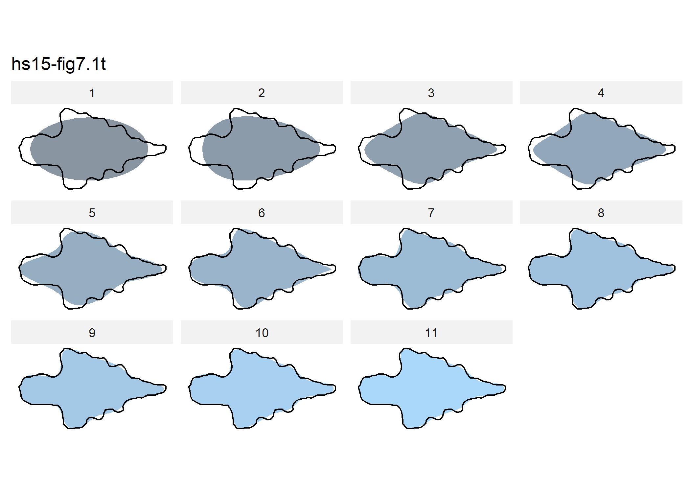

``` r
# generate efa outlines with 11 harmonics
efa.outlines <- efourier(norm.outlines, 
                         nb.h = 11, 
                         norm = TRUE)

# use efa.outlines for pca
pca.outlines <- PCA(efa.outlines)
```

## PCA

``` r
# pca 
scree_plot(pca.outlines)
```

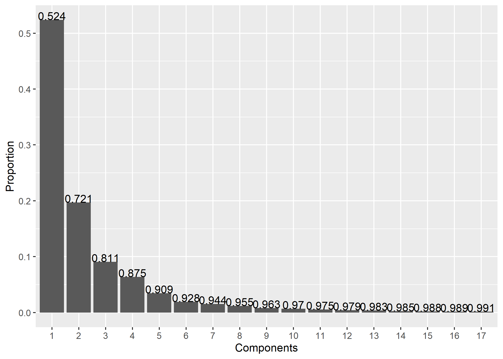

``` r
# plot pca by site
plot_PCA(pca.outlines, 
         morphospace_position = "range",
         ~trinomial, zoom = 1)
```

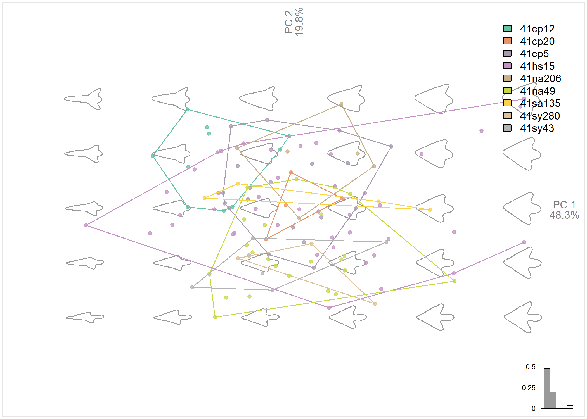

``` r
# plot pca by raw material
plot_PCA(pca.outlines, 
         morphospace_position = "range",
         ~raw.mat, zoom = 1)
```

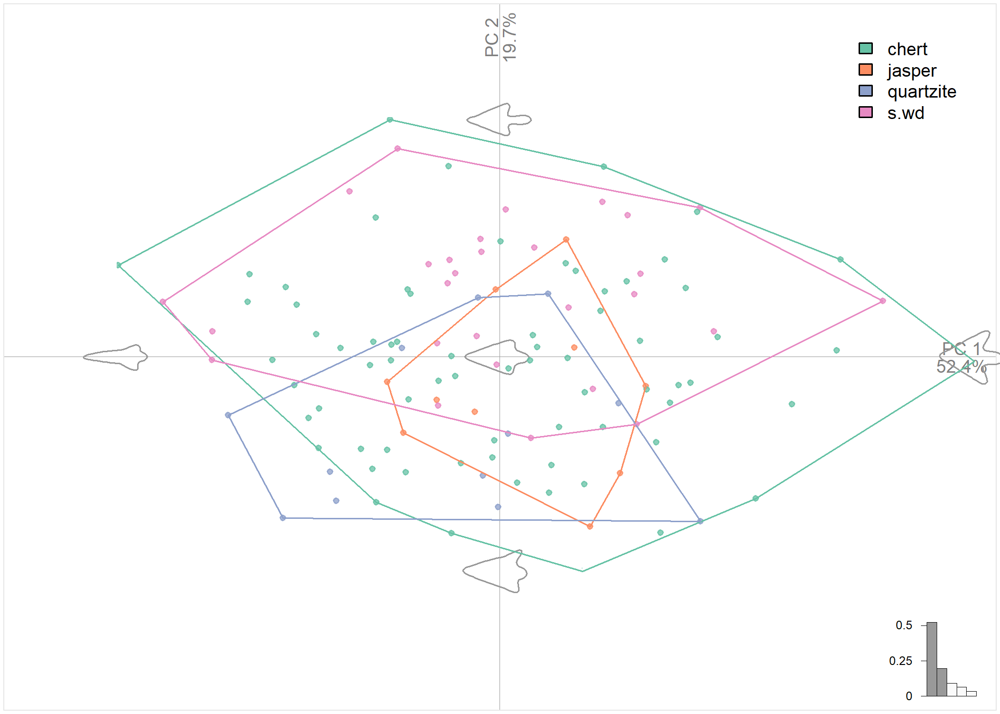

``` r
# plot pca by context
plot_PCA(pca.outlines, 
         morphospace_position = "range",
         ~context, zoom = 1)
```

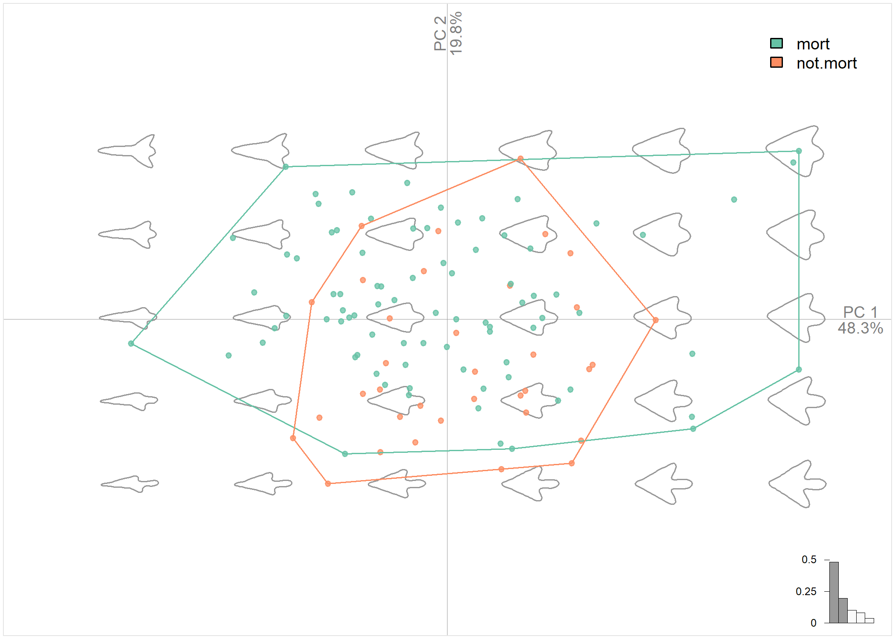

``` r
# contribution of each pc
# by site
boxplot(pca.outlines, ~trinomial, nax = 1:5)
```

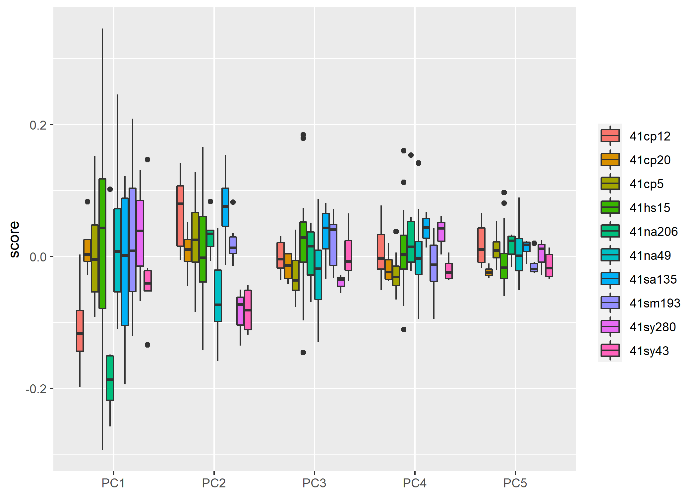

``` r
# by raw material
boxplot(pca.outlines, ~raw.mat, nax = 1:5)
```

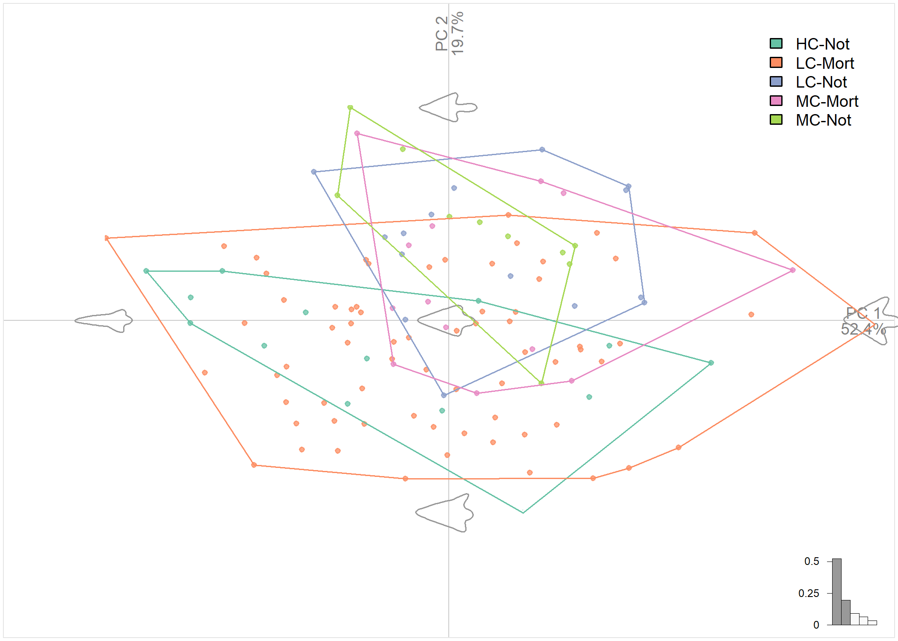

``` r
# by raw material
boxplot(pca.outlines, ~context, nax = 1:5)
```

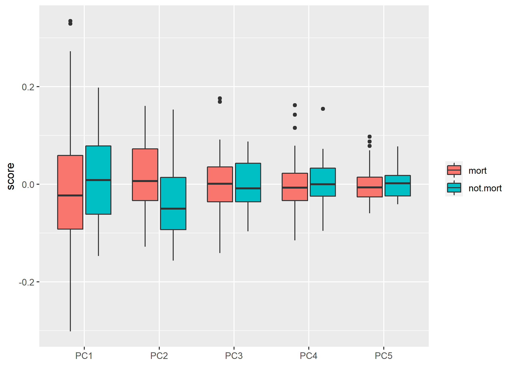

``` r
# mean shape + 2sd for the first 10 pcs
PCcontrib(pca.outlines, nax = 1:5)
```

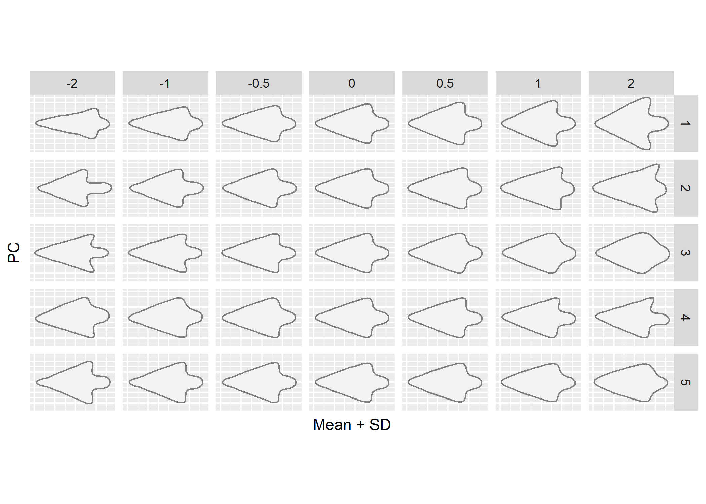

## MANOVA + MANOVA\_PW

``` r
# manova

# shape difference between sites?
MANOVA(pca.outlines, 'trinomial')
```

    ## PC axes 1 to 17 were retained

    ##            Df Hotelling-Lawley approx F num Df den Df    Pr(>F)    
    ## fac         6           3.4464   2.8157    102    500 3.175e-14 ***
    ## Residuals 101                                                      
    ## ---
    ## Signif. codes:  0 '***' 0.001 '**' 0.01 '*' 0.05 '.' 0.1 ' ' 1

``` r
# which differ?
MANOVA_PW(pca.outlines, 'trinomial')
```

    ## '41sy280' has 3 rows, and 'retain' is set accordingly

    ## PC axes 1 to 3 were retained

    ## 41cp1241cp20

    ## 41cp1241cp5

    ## 41cp1241hs15

    ## 41cp1241na49

    ## 41cp1241sy280

    ## 41cp1241sy43

    ## 41cp2041cp5

    ## 41cp2041hs15

    ## 41cp2041na49

    ## 41cp2041sy280

    ## 41cp2041sy43

    ## 41cp541hs15

    ## 41cp541na49

    ## 41cp541sy280

    ## 41cp541sy43

    ## 41hs1541na49

    ## 41hs1541sy280

    ## 41hs1541sy43

    ## 41na4941sy280

    ## 41na4941sy43

    ## 41sy28041sy43

    ## $stars.tab
    ##         41cp12 41cp20 41cp5 41hs15 41na49 41sy280 41sy43
    ## 41cp12         *      ***   **     ***    **      ***   
    ## 41cp20                -     -      -      -       *     
    ## 41cp5                       ***    ***    .       **    
    ## 41hs15                             ***    *       **    
    ## 41na49                                    -       -     
    ## 41sy280                                           -     
    ## 
    ## $summary (see also $manovas)
    ##                  Df  Pillai approx F num Df den Df    Pr(>F)
    ## 41cp12 - 41cp20   1 0.62329   5.5151      3     10 1.700e-02
    ## 41cp12 - 41cp5    1 0.49432   7.8203      3     24 8.222e-04
    ## 41cp12 - 41hs15   1 0.22298   4.7828      3     50 5.241e-03
    ## 41cp12 - 41na49   1 0.67743  20.3014      3     29 2.761e-07
    ## 41cp12 - 41sy280  1 0.70658   7.2241      3      9 9.052e-03
    ## 41cp12 - 41sy43   1 0.81600  17.7392      3     12 1.044e-04
    ## 41cp20 - 41cp5    1 0.06794   0.4373      3     18 7.290e-01
    ## 41cp20 - 41hs15   1 0.07287   1.1527      3     44 3.385e-01
    ## 41cp20 - 41na49   1 0.20657   1.9960      3     23 1.427e-01
    ## 41cp20 - 41sy280  1 0.59888   1.4930      3      3 3.749e-01
    ## 41cp20 - 41sy43   1 0.82953   9.7325      3      6 1.012e-02
    ## 41cp5 - 41hs15    1 0.31764   8.9998      3     58 5.512e-05
    ## 41cp5 - 41na49    1 0.37317   7.3422      3     37 5.567e-04
    ## 41cp5 - 41sy280   1 0.31447   2.5994      3     17 8.592e-02
    ## 41cp5 - 41sy43    1 0.44354   5.3139      3     20 7.396e-03
    ## 41hs15 - 41na49   1 0.41041  14.6181      3     63 2.483e-07
    ## 41hs15 - 41sy280  1 0.16740   2.8818      3     43 4.670e-02
    ## 41hs15 - 41sy43   1 0.25059   5.1271      3     46 3.831e-03
    ## 41na49 - 41sy280  1 0.02621   0.1974      3     22 8.970e-01
    ## 41na49 - 41sy43   1 0.04230   0.3681      3     25 7.767e-01
    ## 41sy280 - 41sy43  1 0.12509   0.2383      3      5 8.663e-01

``` r
# shape difference between raw.mat?
MANOVA(pca.outlines, 'raw.mat')
```

    ## PC axes 1 to 17 were retained

    ##            Df Hotelling-Lawley approx F num Df den Df    Pr(>F)    
    ## fac         3            1.576   2.6781     51    260 1.953e-07 ***
    ## Residuals 104                                                      
    ## ---
    ## Signif. codes:  0 '***' 0.001 '**' 0.01 '*' 0.05 '.' 0.1 ' ' 1

``` r
# which differ?
MANOVA_PW(pca.outlines, 'raw.mat')
```

    ## 'jasper' has 10 rows, and 'retain' is set accordingly

    ## PC axes 1 to 10 were retained

    ## chertjasper

    ## chertquartzite

    ## cherts.wd

    ## jasperquartzite

    ## jaspers.wd

    ## quartzites.wd

    ## $stars.tab
    ##           chert jasper quartzite s.wd
    ## chert           *      -         *** 
    ## jasper                 -         **  
    ## quartzite                        *** 
    ## 
    ## $summary (see also $manovas)
    ##                    Df Pillai approx F num Df den Df    Pr(>F)
    ## chert - jasper      1 0.2602    2.110     10     60 3.736e-02
    ## chert - quartzite   1 0.2103    1.652     10     62 1.131e-01
    ## chert - s.wd        1 0.4049    5.102     10     75 1.183e-05
    ## jasper - quartzite  1 0.6096    1.718     10     11 1.939e-01
    ## jasper - s.wd       1 0.5778    3.284     10     24 8.228e-03
    ## quartzite - s.wd    1 0.6808    5.546     10     26 2.094e-04

``` r
# shape difference by context?
MANOVA(pca.outlines, 'context')
```

    ## PC axes 1 to 17 were retained

    ##            Df Hotelling-Lawley approx F num Df den Df    Pr(>F)    
    ## fac         1          0.83095   4.3991     17     90 1.739e-06 ***
    ## Residuals 106                                                      
    ## ---
    ## Signif. codes:  0 '***' 0.001 '**' 0.01 '*' 0.05 '.' 0.1 ' ' 1

## Mean shapes

``` r
# mean shapes

# site
ms.2 <- MSHAPES(efa.outlines, ~trinomial)
plot_MSHAPES(ms.2, size = 0.75)
```


``` r
# raw material
ms.3 <- MSHAPES(efa.outlines, ~raw.mat)
plot_MSHAPES(ms.3, size = 0.75)
```

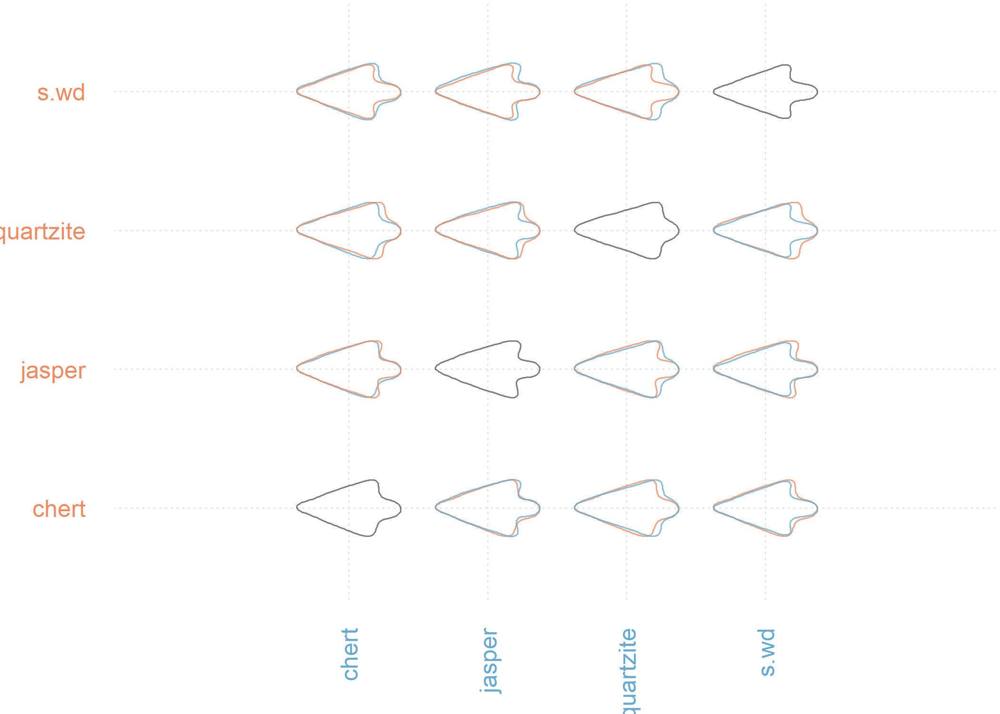

``` r
# context
ms.4 <- MSHAPES(efa.outlines, ~context)
plot_MSHAPES(ms.4, size = 0.75)
```


