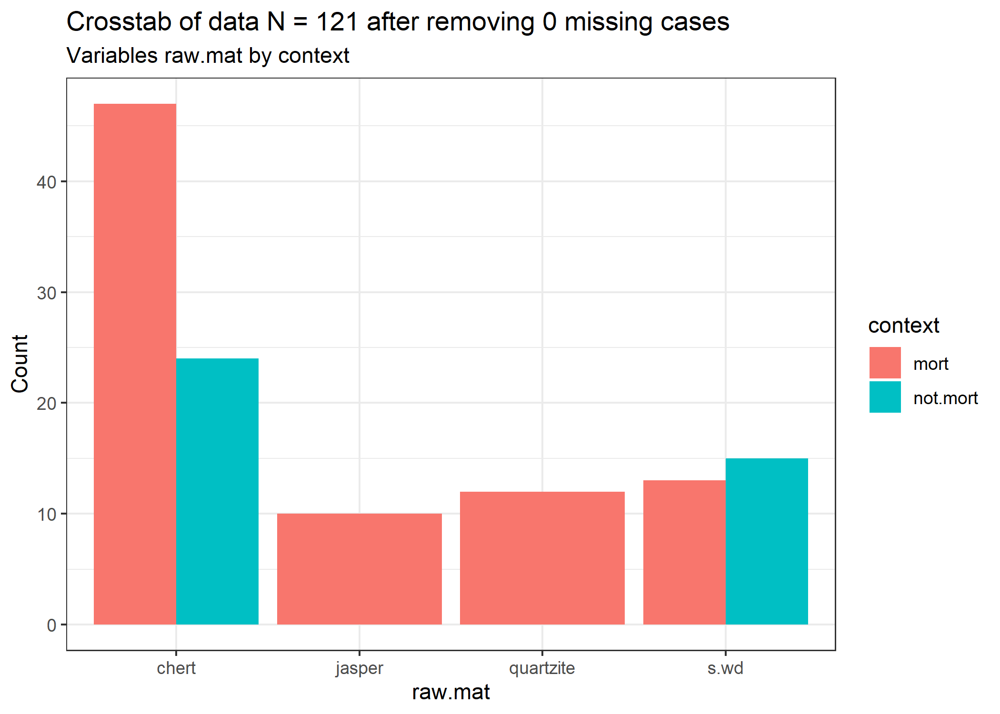
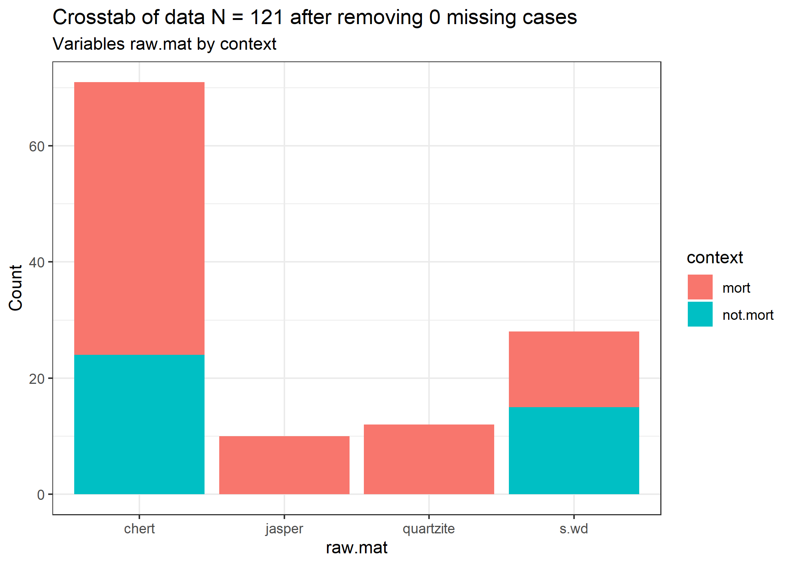
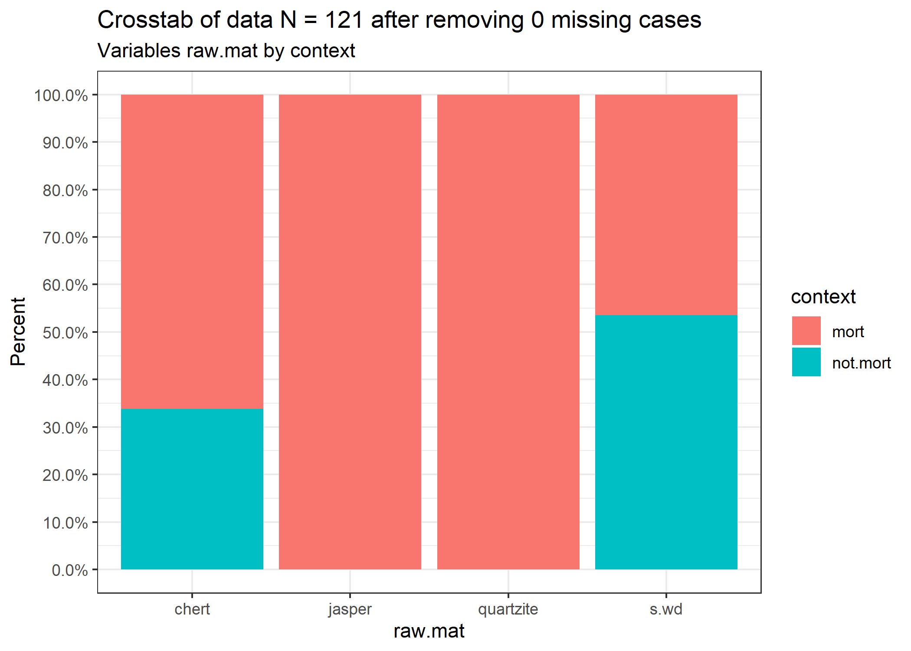
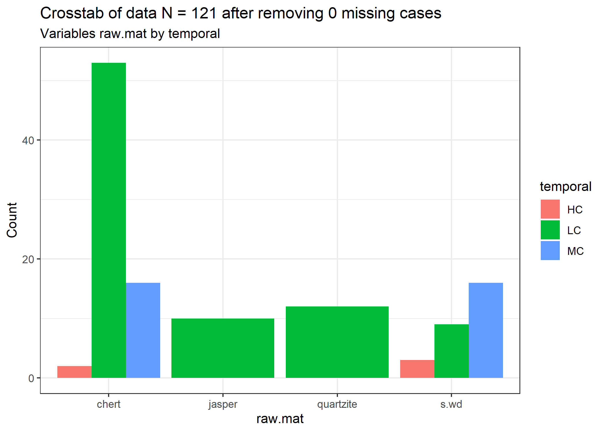
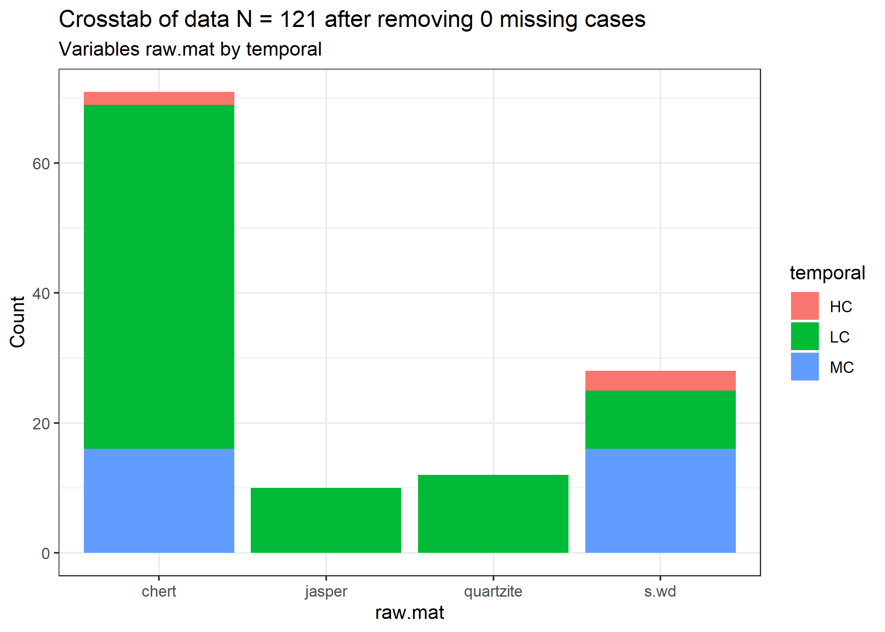
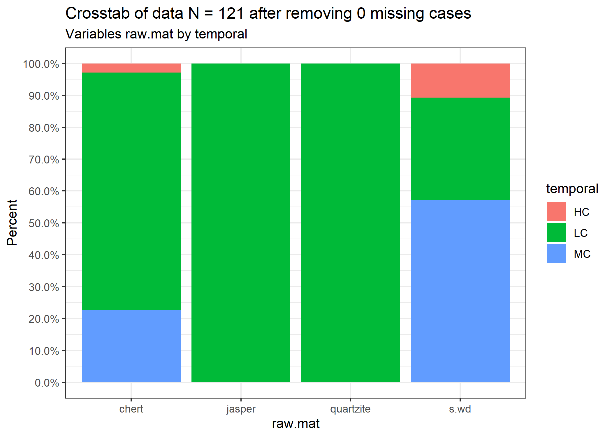
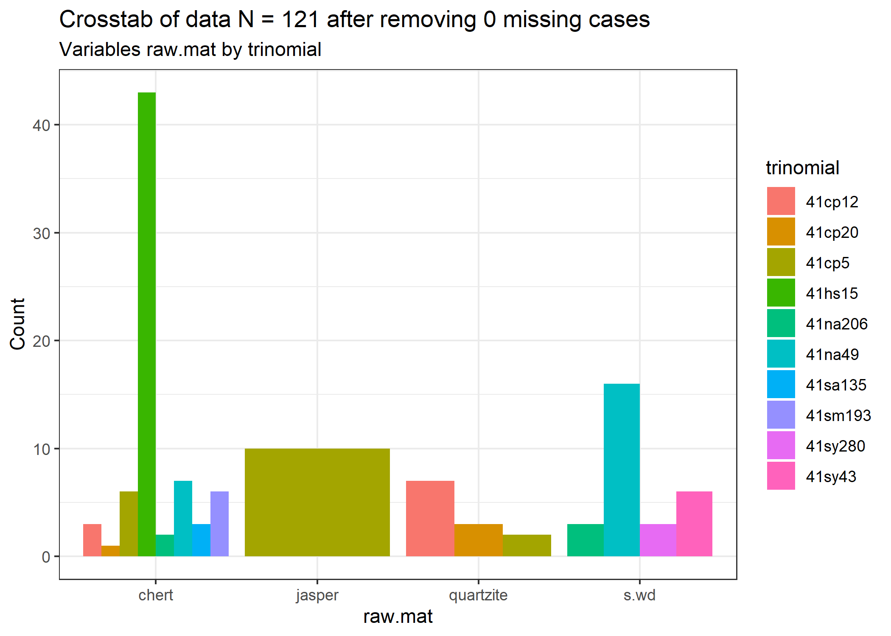
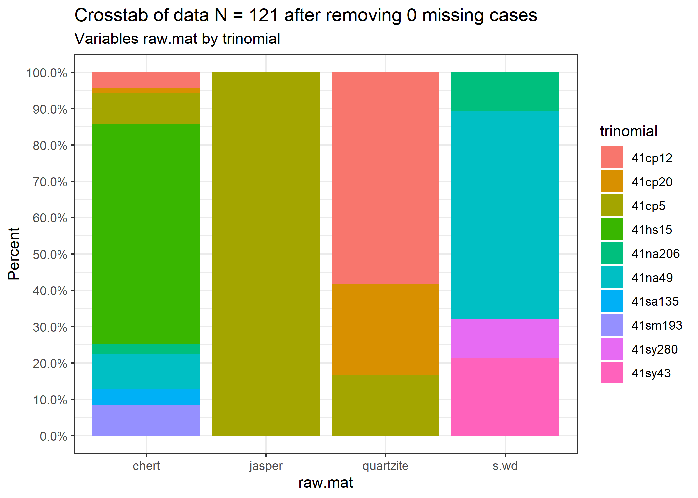

X^2
================
Robert Z. Selden, Jr.
22 October, 2020

## X^2 and descriptive statistics

### Load packages + data

``` r
# qualitative data for Perdiz points
library(here)
```

    ## here() starts at E:/github/perdiz

``` r
library(CGPfunctions)
```

    ## Registered S3 methods overwritten by 'lme4':
    ##   method                          from
    ##   cooks.distance.influence.merMod car 
    ##   influence.merMod                car 
    ##   dfbeta.influence.merMod         car 
    ##   dfbetas.influence.merMod        car

``` r
library(lsr)

# read attribute data
data <- as.data.frame(read.csv("perdiz.csv", header = TRUE, as.is = TRUE))

# variables as factors
raw <- as.factor(data$raw.mat) # raw material
con <- as.factor(data$context) # burial context
temp <- as.factor(data$temporal) # temporal period
site <- as.factor(data$trinomial) # site
```

### Comparison of raw material by mortuary context

``` r
#####
## raw material by burial context
# tables
r.tab <- table(raw, con) # table of raw material by burial context
ftable(r.tab) # flat contingency table
```

    ##           con mort not.mort
    ## raw                        
    ## chert           47       24
    ## jasper          10        0
    ## quartzite       12        0
    ## s.wd            13       15

``` r
summary(r.tab) # zeros in table
```

    ## Number of cases in table: 121 
    ## Number of factors: 2 
    ## Test for independence of all factors:
    ##  Chisq = 16.381, df = 3, p-value = 0.0009471
    ##  Chi-squared approximation may be incorrect

``` r
chisq.test(r.tab, correct = FALSE, simulate.p.value = TRUE) # simulate p-value
```

    ## 
    ##  Pearson's Chi-squared test with simulated p-value (based on 2000
    ##  replicates)
    ## 
    ## data:  r.tab
    ## X-squared = 16.381, df = NA, p-value = 0.0009995

``` r
chisq.test(r.tab, correct = FALSE, simulate.p.value = TRUE)$stdres # residuals
```

    ##            con
    ## raw               mort   not.mort
    ##   chert     -0.4407304  0.4407304
    ##   jasper     2.2769661 -2.2769661
    ##   quartzite  2.5170708 -2.5170708
    ##   s.wd      -2.7559495  2.7559495

``` r
sig <- .05 # significance level
# adjust for multiple testing with Bonferroni
sig.adj <- sig/(nrow(r.tab)*ncol(r.tab))
# z value
qnorm(sig.adj/2) # above Z in residuals = significant
```

    ## [1] -2.734369

``` r
# effect size
cramersV(r.tab)
```

    ## [1] 0.3679445

``` r
# number of observations
margin.table(r.tab,1) # raw material
```

    ## raw
    ##     chert    jasper quartzite      s.wd 
    ##        71        10        12        28

``` r
margin.table(r.tab,2) # mortuary/no
```

    ## con
    ##     mort not.mort 
    ##       82       39

``` r
# percentages
prop.table(r.tab)
```

    ##            con
    ## raw               mort   not.mort
    ##   chert     0.38842975 0.19834711
    ##   jasper    0.08264463 0.00000000
    ##   quartzite 0.09917355 0.00000000
    ##   s.wd      0.10743802 0.12396694

``` r
prop.table(r.tab,1) # perc by raw.mat (read l/r)
```

    ##            con
    ## raw              mort  not.mort
    ##   chert     0.6619718 0.3380282
    ##   jasper    1.0000000 0.0000000
    ##   quartzite 1.0000000 0.0000000
    ##   s.wd      0.4642857 0.5357143

``` r
prop.table(r.tab,2) # perc by mortuary/no (read top to bottom)
```

    ##            con
    ## raw              mort  not.mort
    ##   chert     0.5731707 0.6153846
    ##   jasper    0.1219512 0.0000000
    ##   quartzite 0.1463415 0.0000000
    ##   s.wd      0.1585366 0.3846154

``` r
# plot cross tabs
PlotXTabs(data, context, raw.mat) # side by side
```

    ## Plotted dataset data variables context by raw.mat



``` r
PlotXTabs(data, context, raw.mat, "stack") # stacked
```

    ## Plotted dataset data variables context by raw.mat



``` r
PlotXTabs(data, context, raw.mat, plottype = "percent") # as percentages
```

    ## Plotted dataset data variables context by raw.mat



### Comparison of raw material by temporal period

``` r
#####
## raw material by temporal period
# tables
r.tab2 <- table(raw, temp) # table of raw material by temporal period
ftable(r.tab2) # flat contingency table
```

    ##           temp HC LC MC
    ## raw                    
    ## chert           2 53 16
    ## jasper          0 10  0
    ## quartzite       0 12  0
    ## s.wd            3  9 16

``` r
summary(r.tab2) # zeros in table
```

    ## Number of cases in table: 121 
    ## Number of factors: 2 
    ## Test for independence of all factors:
    ##  Chisq = 29.195, df = 6, p-value = 5.588e-05
    ##  Chi-squared approximation may be incorrect

``` r
chisq.test(r.tab2, simulate.p.value = TRUE) # simulate p-value
```

    ## 
    ##  Pearson's Chi-squared test with simulated p-value (based on 2000
    ##  replicates)
    ## 
    ## data:  r.tab2
    ## X-squared = 29.195, df = NA, p-value = 0.0009995

``` r
chisq.test(r.tab2, correct = FALSE, simulate.p.value = TRUE)$stdres # residuals
```

    ##            temp
    ## raw                 HC         LC         MC
    ##   chert     -0.8662494  1.4869088 -1.1623791
    ##   jasper    -0.6854680  2.1912525 -1.9797538
    ##   quartzite -0.7577502  2.4223187 -2.1885176
    ##   s.wd       1.9960116 -4.8835433  4.2008342

``` r
sig <- .05 # significance level
# adjust for multiple testing with Bonferroni
sig.adj <- sig/(nrow(r.tab2)*ncol(r.tab2))
# z value
qnorm(sig.adj/2) # above Z in residuals = significant
```

    ## [1] -2.86526

``` r
# effect size
cramersV(r.tab2)
```

    ## [1] 0.3473326

``` r
# number of observations
margin.table(r.tab2,1) # raw material
```

    ## raw
    ##     chert    jasper quartzite      s.wd 
    ##        71        10        12        28

``` r
margin.table(r.tab2,2) # temporal period
```

    ## temp
    ## HC LC MC 
    ##  5 84 32

``` r
# percentages
prop.table(r.tab2)
```

    ##            temp
    ## raw                 HC         LC         MC
    ##   chert     0.01652893 0.43801653 0.13223140
    ##   jasper    0.00000000 0.08264463 0.00000000
    ##   quartzite 0.00000000 0.09917355 0.00000000
    ##   s.wd      0.02479339 0.07438017 0.13223140

``` r
prop.table(r.tab2,1) # perc by raw.mat (read l/r)
```

    ##            temp
    ## raw                 HC         LC         MC
    ##   chert     0.02816901 0.74647887 0.22535211
    ##   jasper    0.00000000 1.00000000 0.00000000
    ##   quartzite 0.00000000 1.00000000 0.00000000
    ##   s.wd      0.10714286 0.32142857 0.57142857

``` r
prop.table(r.tab2,2) # perc by temporal period (read top to bottom)
```

    ##            temp
    ## raw                HC        LC        MC
    ##   chert     0.4000000 0.6309524 0.5000000
    ##   jasper    0.0000000 0.1190476 0.0000000
    ##   quartzite 0.0000000 0.1428571 0.0000000
    ##   s.wd      0.6000000 0.1071429 0.5000000

``` r
# plot cross tabs
PlotXTabs(data, temporal, raw.mat) # side by side
```

    ## Plotted dataset data variables temporal by raw.mat



``` r
PlotXTabs(data, temporal, raw.mat, "stack") # stacked
```

    ## Plotted dataset data variables temporal by raw.mat



``` r
PlotXTabs(data, temporal, raw.mat, plottype = "percent") # as percentages
```

    ## Plotted dataset data variables temporal by raw.mat



### Comparison of raw material by site

``` r
#####
## raw material by site
# tables
r.tab3 <- table(raw, site) #table of raw material by site
ftable(r.tab3) # flat contingency table
```

    ##           site 41cp12 41cp20 41cp5 41hs15 41na206 41na49 41sa135 41sm193 41sy280 41sy43
    ## raw                                                                                    
    ## chert               3      1     6     43       2      7       3       6       0      0
    ## jasper              0      0    10      0       0      0       0       0       0      0
    ## quartzite           7      3     2      0       0      0       0       0       0      0
    ## s.wd                0      0     0      0       3     16       0       0       3      6

``` r
summary(r.tab3) # zeros in table
```

    ## Number of cases in table: 121 
    ## Number of factors: 2 
    ## Test for independence of all factors:
    ##  Chisq = 214.31, df = 27, p-value = 4.551e-31
    ##  Chi-squared approximation may be incorrect

``` r
chisq.test(r.tab3, simulate.p.value = TRUE) # simulate p-value
```

    ## 
    ##  Pearson's Chi-squared test with simulated p-value (based on 2000
    ##  replicates)
    ## 
    ## data:  r.tab3
    ## X-squared = 214.31, df = NA, p-value = 0.0004998

``` r
chisq.test(r.tab3, correct = FALSE, simulate.p.value = TRUE)$stdres # residuals
```

    ##            site
    ## raw             41cp12     41cp20      41cp5     41hs15    41na206     41na49
    ##   chert     -1.9228548 -1.3910514 -2.3668063  6.8538633 -0.8662494 -3.0564979
    ##   jasper    -0.9909910 -0.6104755  7.8979350 -2.4514222 -0.6854680 -1.5994920
    ##   quartzite  6.6368459  4.4287018  0.1836569 -2.7099232 -0.7577502 -1.7681575
    ##   s.wd      -1.8116268 -1.1160080 -2.5231779 -4.4814355  1.9960116  5.8662120
    ##            site
    ## raw            41sa135    41sm193    41sy280     41sy43
    ##   chert      1.4718655  2.1085078 -2.0900491 -2.9940811
    ##   jasper    -0.5264424 -0.7541503 -0.5264424 -0.7541503
    ##   quartzite -0.5819554 -0.8336750 -0.5819554 -0.8336750
    ##   s.wd      -0.9623872 -1.3786592  3.1965004  4.5791181

``` r
sig <- .05 # significance level
# adjust for multiple testing with Bonferroni
sig.adj <- sig/(nrow(r.tab3)*ncol(r.tab3))
# z value
qnorm(sig.adj/2) # above Z in residuals = significant
```

    ## [1] -3.227218

``` r
# effect size
cramersV(r.tab3)
```

    ## [1] 0.7683687

``` r
# number of observations
margin.table(r.tab3,1) # raw material
```

    ## raw
    ##     chert    jasper quartzite      s.wd 
    ##        71        10        12        28

``` r
margin.table(r.tab3,2) # site
```

    ## site
    ##  41cp12  41cp20   41cp5  41hs15 41na206  41na49 41sa135 41sm193 41sy280  41sy43 
    ##      10       4      18      43       5      23       3       6       3       6

``` r
# percentages
prop.table(r.tab3)
```

    ##            site
    ## raw              41cp12      41cp20       41cp5      41hs15     41na206
    ##   chert     0.024793388 0.008264463 0.049586777 0.355371901 0.016528926
    ##   jasper    0.000000000 0.000000000 0.082644628 0.000000000 0.000000000
    ##   quartzite 0.057851240 0.024793388 0.016528926 0.000000000 0.000000000
    ##   s.wd      0.000000000 0.000000000 0.000000000 0.000000000 0.024793388
    ##            site
    ## raw              41na49     41sa135     41sm193     41sy280      41sy43
    ##   chert     0.057851240 0.024793388 0.049586777 0.000000000 0.000000000
    ##   jasper    0.000000000 0.000000000 0.000000000 0.000000000 0.000000000
    ##   quartzite 0.000000000 0.000000000 0.000000000 0.000000000 0.000000000
    ##   s.wd      0.132231405 0.000000000 0.000000000 0.024793388 0.049586777

``` r
prop.table(r.tab3,1) # perc by raw.mat (read l/r)
```

    ##            site
    ## raw             41cp12     41cp20      41cp5     41hs15    41na206     41na49
    ##   chert     0.04225352 0.01408451 0.08450704 0.60563380 0.02816901 0.09859155
    ##   jasper    0.00000000 0.00000000 1.00000000 0.00000000 0.00000000 0.00000000
    ##   quartzite 0.58333333 0.25000000 0.16666667 0.00000000 0.00000000 0.00000000
    ##   s.wd      0.00000000 0.00000000 0.00000000 0.00000000 0.10714286 0.57142857
    ##            site
    ## raw            41sa135    41sm193    41sy280     41sy43
    ##   chert     0.04225352 0.08450704 0.00000000 0.00000000
    ##   jasper    0.00000000 0.00000000 0.00000000 0.00000000
    ##   quartzite 0.00000000 0.00000000 0.00000000 0.00000000
    ##   s.wd      0.00000000 0.00000000 0.10714286 0.21428571

``` r
prop.table(r.tab3,2) # perc by site (read top to bottom)
```

    ##            site
    ## raw            41cp12    41cp20     41cp5    41hs15   41na206    41na49
    ##   chert     0.3000000 0.2500000 0.3333333 1.0000000 0.4000000 0.3043478
    ##   jasper    0.0000000 0.0000000 0.5555556 0.0000000 0.0000000 0.0000000
    ##   quartzite 0.7000000 0.7500000 0.1111111 0.0000000 0.0000000 0.0000000
    ##   s.wd      0.0000000 0.0000000 0.0000000 0.0000000 0.6000000 0.6956522
    ##            site
    ## raw           41sa135   41sm193   41sy280    41sy43
    ##   chert     1.0000000 1.0000000 0.0000000 0.0000000
    ##   jasper    0.0000000 0.0000000 0.0000000 0.0000000
    ##   quartzite 0.0000000 0.0000000 0.0000000 0.0000000
    ##   s.wd      0.0000000 0.0000000 1.0000000 1.0000000

``` r
# plot cross tabs
PlotXTabs(data, trinomial, raw.mat) # side by side
```

    ## Plotted dataset data variables trinomial by raw.mat



``` r
PlotXTabs(data, trinomial, raw.mat, "stack") # stacked
```

    ## Plotted dataset data variables trinomial by raw.mat


``` r
PlotXTabs(data, trinomial, raw.mat, plottype = "percent") # as percentages
```

    ## Plotted dataset data variables trinomial by raw.mat


